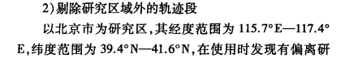

北京市经纬度范围：

区域调度实验：

1. 通过数据分析得出乘客需求的时空分布，用网格道路模拟车辆和乘客上车点的时空分布，
   1. 通过文献参考，找到工作日的高峰时间和低谷时间，用这两个状态模拟人多车少和车多人少的情况
      1. 统计海淀区的乘客请求和车辆分布
      2. 统计海淀区的分块，统计每个块的路口数目和块内车乘分布
      3. 根据统计进行乘客和车辆的模拟
   2. 通过数据分析，找到特定时间点的车辆乘客区域分布状况，用网格道路模拟出状况
   3. 进行测试实验，设置好要收集的数据

2. 五位区域调度和六位区域调度的结果对比

3. 进行调度实验，分析调度结果和预设最佳匹配结果的符合程度

如有可能，筛选一下北京市的道路数据看看有多少条

