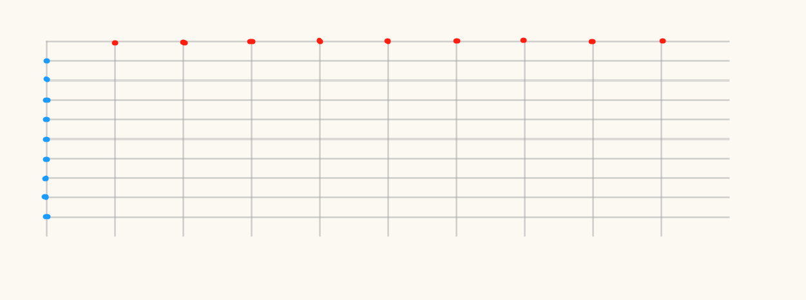
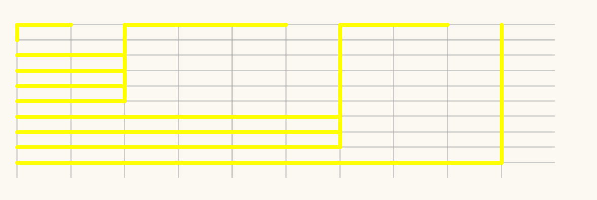
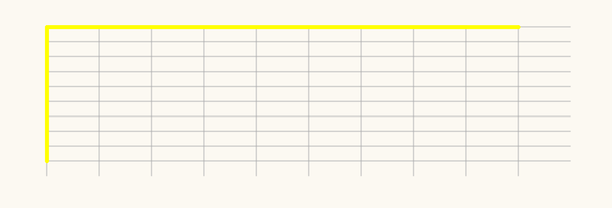
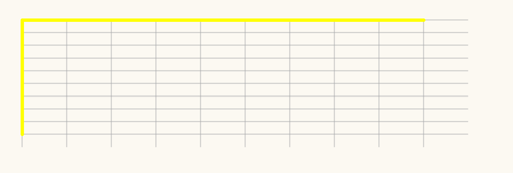
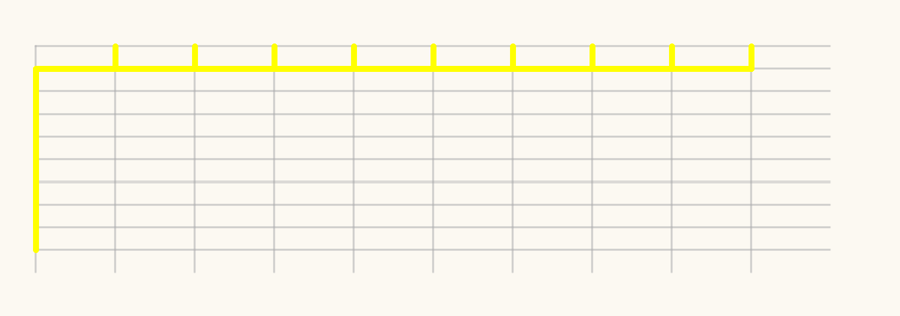
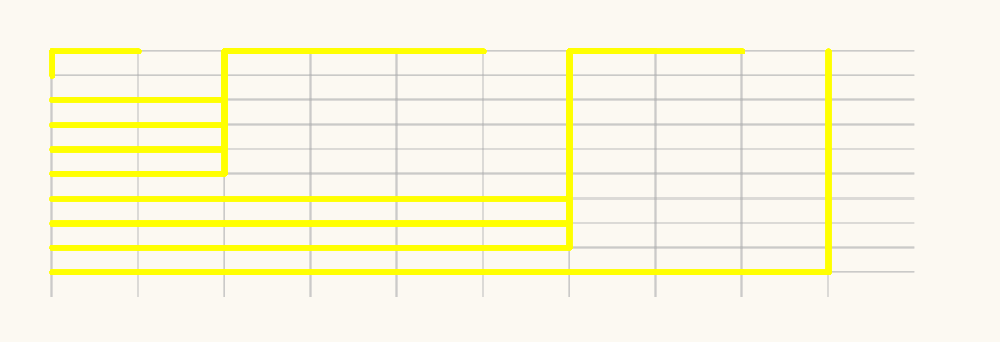
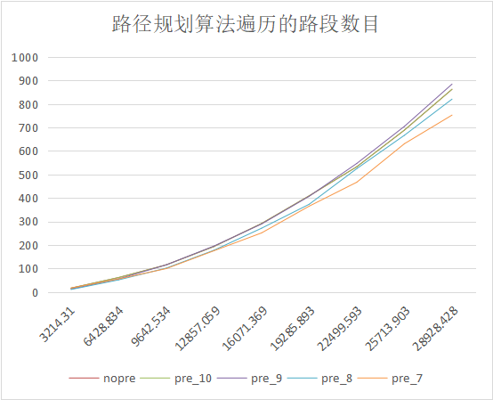
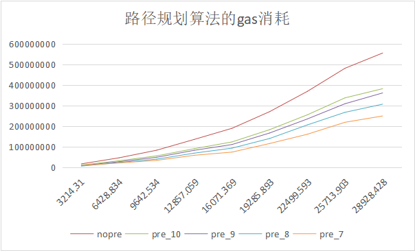
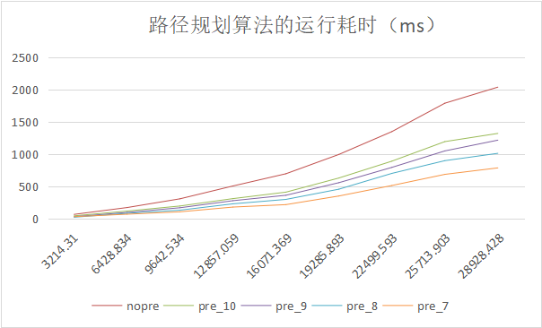

nopre：未进行距离计算前缀匹配优化的路径规划算法

prefix_：进行距离计算前缀匹配优化后的路径规划算法

prefix下划线后的参数含义：距离计算基于的GeoHash的精度（即GeoHash长度），参数越小，代表GeoHash的位数越短，距离计算基于的GeoHash的格子规模就越大。


StoreMap_prefix.sol合约部署

```
abi = JSON.parse('[{\"constant\":false,\"inputs\":[{\"internalType\":\"bytes32\",\"name\":\"hash\",\"type\":\"bytes32\"},{\"internalType\":\"uint256\",\"name\":\"gid\",\"type\":\"uint256\"}],\"name\":\"add_area_line\",\"outputs\":[],\"payable\":false,\"stateMutability\":\"nonpayable\",\"type\":\"function\"},{\"constant\":false,\"inputs\":[{\"internalType\":\"uint256\",\"name\":\"gid\",\"type\":\"uint256\"},{\"internalType\":\"int64\",\"name\":\"minzoom\",\"type\":\"int64\"},{\"internalType\":\"int64\",\"name\":\"cost\",\"type\":\"int64\"},{\"internalType\":\"int64\",\"name\":\"source\",\"type\":\"int64\"},{\"internalType\":\"int64\",\"name\":\"target\",\"type\":\"int64\"},{\"internalType\":\"bool\",\"name\":\"oneway\",\"type\":\"bool\"},{\"internalType\":\"bool\",\"name\":\"building\",\"type\":\"bool\"},{\"internalType\":\"bytes32\",\"name\":\"highway\",\"type\":\"bytes32\"},{\"internalType\":\"bytes32\",\"name\":\"name\",\"type\":\"bytes32\"},{\"internalType\":\"bytes32\",\"name\":\"gtype\",\"type\":\"bytes32\"},{\"internalType\":\"bytes32[]\",\"name\":\"path\",\"type\":\"bytes32[]\"}],\"name\":\"add_onetype\",\"outputs\":[],\"payable\":false,\"stateMutability\":\"nonpayable\",\"type\":\"function\"},{\"constant\":true,\"inputs\":[{\"internalType\":\"bytes32\",\"name\":\"\",\"type\":\"bytes32\"}],\"name\":\"adjacencyList\",\"outputs\":[{\"internalType\":\"uint256\",\"name\":\"adjnum\",\"type\":\"uint256\"}],\"payable\":false,\"stateMutability\":\"view\",\"type\":\"function\"},{\"constant\":false,\"inputs\":[{\"internalType\":\"bytes32\",\"name\":\"startGeohash\",\"type\":\"bytes32\"},{\"internalType\":\"bytes32\",\"name\":\"endGeohash\",\"type\":\"bytes32\"}],\"name\":\"astar\",\"outputs\":[{\"internalType\":\"bytes32[]\",\"name\":\"backwards\",\"type\":\"bytes32[]\"},{\"internalType\":\"uint256\",\"name\":\"costAll\",\"type\":\"uint256\"},{\"internalType\":\"uint256\",\"name\":\"searchNum\",\"type\":\"uint256\"},{\"internalType\":\"uint256\",\"name\":\"u2\",\"type\":\"uint256\"}],\"payable\":false,\"stateMutability\":\"nonpayable\",\"type\":\"function\"},{\"constant\":false,\"inputs\":[{\"internalType\":\"uint256\",\"name\":\"newP\",\"type\":\"uint256\"}],\"name\":\"changeP\",\"outputs\":[{\"internalType\":\"uint256\",\"name\":\"\",\"type\":\"uint256\"}],\"payable\":false,\"stateMutability\":\"nonpayable\",\"type\":\"function\"},{\"constant\":false,\"inputs\":[{\"internalType\":\"uint256\",\"name\":\"newPrecision\",\"type\":\"uint256\"}],\"name\":\"changePrecision\",\"outputs\":[{\"internalType\":\"uint256\",\"name\":\"\",\"type\":\"uint256\"}],\"payable\":false,\"stateMutability\":\"nonpayable\",\"type\":\"function\"},{\"constant\":false,\"inputs\":[],\"name\":\"dequeue\",\"outputs\":[],\"payable\":false,\"stateMutability\":\"nonpayable\",\"type\":\"function\"},{\"constant\":false,\"inputs\":[{\"internalType\":\"bytes32\",\"name\":\"geohash\",\"type\":\"bytes32\"},{\"internalType\":\"uint256\",\"name\":\"cost\",\"type\":\"uint256\"}],\"name\":\"enqueue\",\"outputs\":[],\"payable\":false,\"stateMutability\":\"nonpayable\",\"type\":\"function\"},{\"constant\":true,\"inputs\":[{\"internalType\":\"bytes32\",\"name\":\"\",\"type\":\"bytes32\"}],\"name\":\"geo_maps\",\"outputs\":[{\"internalType\":\"uint256\",\"name\":\"num\",\"type\":\"uint256\"}],\"payable\":false,\"stateMutability\":\"view\",\"type\":\"function\"},{\"constant\":true,\"inputs\":[{\"internalType\":\"string\",\"name\":\"geohash\",\"type\":\"string\"}],\"name\":\"getLatBlock\",\"outputs\":[{\"internalType\":\"uint256\",\"name\":\"\",\"type\":\"uint256\"}],\"payable\":false,\"stateMutability\":\"view\",\"type\":\"function\"},{\"constant\":true,\"inputs\":[],\"name\":\"getLatDelta\",\"outputs\":[{\"internalType\":\"uint256\",\"name\":\"\",\"type\":\"uint256\"}],\"payable\":false,\"stateMutability\":\"view\",\"type\":\"function\"},{\"constant\":true,\"inputs\":[{\"internalType\":\"string\",\"name\":\"geohash\",\"type\":\"string\"}],\"name\":\"getLonBlock\",\"outputs\":[{\"internalType\":\"uint256\",\"name\":\"\",\"type\":\"uint256\"}],\"payable\":false,\"stateMutability\":\"view\",\"type\":\"function\"},{\"constant\":true,\"inputs\":[{\"internalType\":\"bytes32\",\"name\":\"geohash\",\"type\":\"bytes32\"}],\"name\":\"getLonDelta\",\"outputs\":[{\"internalType\":\"uint256\",\"name\":\"\",\"type\":\"uint256\"}],\"payable\":false,\"stateMutability\":\"view\",\"type\":\"function\"},{\"constant\":true,\"inputs\":[{\"internalType\":\"bytes32\",\"name\":\"hash\",\"type\":\"bytes32\"}],\"name\":\"get_types\",\"outputs\":[{\"internalType\":\"int64[]\",\"name\":\"feature\",\"type\":\"int64[]\"},{\"internalType\":\"bytes32[]\",\"name\":\"names\",\"type\":\"bytes32[]\"},{\"internalType\":\"bytes32[]\",\"name\":\"highways\",\"type\":\"bytes32[]\"},{\"internalType\":\"bytes32[]\",\"name\":\"gtypes\",\"type\":\"bytes32[]\"},{\"internalType\":\"bytes32[]\",\"name\":\"path\",\"type\":\"bytes32[]\"}],\"payable\":false,\"stateMutability\":\"view\",\"type\":\"function\"},{\"constant\":true,\"inputs\":[{\"internalType\":\"bytes32\",\"name\":\"nextGeohash\",\"type\":\"bytes32\"},{\"internalType\":\"bytes32\",\"name\":\"endGeohash\",\"type\":\"bytes32\"}],\"name\":\"manhattan\",\"outputs\":[{\"internalType\":\"uint256\",\"name\":\"\",\"type\":\"uint256\"}],\"payable\":false,\"stateMutability\":\"view\",\"type\":\"function\"},{\"constant\":true,\"inputs\":[{\"internalType\":\"bytes32\",\"name\":\"geohash1\",\"type\":\"bytes32\"},{\"internalType\":\"bytes32\",\"name\":\"geohash2\",\"type\":\"bytes32\"}],\"name\":\"sliceGeoHash\",\"outputs\":[{\"internalType\":\"string\",\"name\":\"\",\"type\":\"string\"},{\"internalType\":\"string\",\"name\":\"\",\"type\":\"string\"},{\"internalType\":\"bool\",\"name\":\"\",\"type\":\"bool\"}],\"payable\":false,\"stateMutability\":\"view\",\"type\":\"function\"},{\"constant\":true,\"inputs\":[],\"name\":\"top\",\"outputs\":[{\"internalType\":\"bytes32\",\"name\":\"\",\"type\":\"bytes32\"}],\"payable\":false,\"stateMutability\":\"view\",\"type\":\"function\"}]')
bytecode = "0x6080604052600160035563238dcec5600a55604051806102000160405280634705b03763ffffffff16815260200163465696b863ffffffff1681526020016344fa136b63ffffffff1681526020016342f3818c63ffffffff168152602001634047df9863ffffffff168152602001633cfdc30163ffffffff16815260200163391d47ef63ffffffff1681526020016334affd4463ffffffff168152602001632fc0cd0a63ffffffff168152602001632a5be18b63ffffffff16815260200163248e875463ffffffff168152602001631e670c6963ffffffff1681526020016317f49d0363ffffffff1681526020016311471e2463ffffffff168152602001630a6f066f63ffffffff16815260200163037d358663ffffffff16815250600b9060106200012d9291906200058c565b5064011c6e7628600c55604051806101c0016040528064011c16c0dc64ffffffffff1681526020016401195a5ae064ffffffffff168152602001640113e84dac64ffffffffff16815260200164010bce063064ffffffffff1681526020016401011f7e6064ffffffffff16815260200163f3f70c0464ffffffffff16815260200163e4751fbc64ffffffffff16815260200163d2bff51064ffffffffff16815260200163bf03342864ffffffffff16815260200163a96f862c64ffffffffff168152602001635fd2740c64ffffffffff16815260200163451c789064ffffffffff1681526020016329bc19bc64ffffffffff168152602001630df4d61864ffffffffff16815250600d90600e62000246929190620005e6565b50640471b9d8a0600e556040518061020001604052806408e0b606e064ffffffffff1681526020016408cad2d70064ffffffffff16815260200164089f426d6064ffffffffff16815260200164085e70318064ffffffffff168152602001640808fbf30064ffffffffff16815260200164079fb8602064ffffffffff168152602001640723a8fde064ffffffffff168152602001640695ffa88064ffffffffff1681526020016405f819a14064ffffffffff16815260200164054b7c316064ffffffffff168152602001640491d0ea8064ffffffffff1681526020016403cce18d2064ffffffffff1681526020016402fe93a06064ffffffffff168152602001640228e3c48064ffffffffff16815260200164014de0cde064ffffffffff168152602001636fa6b0c064ffffffffff16815250600f9060106200038b92919062000641565b5064238dcec500601055604051806102000160405280642382d81b8064ffffffffff16815260200164232b4b5c0064ffffffffff16815260200164227d09b58064ffffffffff168152602001642179c0c60064ffffffffff168152602001642023efcc0064ffffffffff168152602001641e7ee1808064ffffffffff168152602001641c8ea3f78064ffffffffff168152602001641a57fea20064ffffffffff1681526020016417e066850064ffffffffff16815260200164152df0c58064ffffffffff16815260200164124743aa0064ffffffffff168152602001640f3386348064ffffffffff168152602001640bfa4e818064ffffffffff1681526020016408a38f120064ffffffffff16815260200164053783378064ffffffffff1681526020016401be9ac30064ffffffffff168152506011906010620004d192919062000641565b50600a6012556040518060a00160405280601060ff168152602001600860ff168152602001600460ff168152602001600260ff168152602001600160ff168152506013906005620005249291906200069c565b506040518060400160405280602081526020017f30313233343536373839626364656667686a6b6d6e707172737475767778797a8152506014908051906020019062000572929190620006f3565b5060046015553480156200058557600080fd5b50620007a2565b828054828255906000526020600020908101928215620005d3579160200282015b82811115620005d2578251829063ffffffff16905591602001919060010190620005ad565b5b509050620005e291906200077a565b5090565b8280548282559060005260206000209081019282156200062e579160200282015b828111156200062d578251829064ffffffffff1690559160200191906001019062000607565b5b5090506200063d91906200077a565b5090565b82805482825590600052602060002090810192821562000689579160200282015b8281111562000688578251829064ffffffffff1690559160200191906001019062000662565b5b5090506200069891906200077a565b5090565b828054828255906000526020600020908101928215620006e0579160200282015b82811115620006df578251829060ff16905591602001919060010190620006bd565b5b509050620006ef91906200077a565b5090565b828054600181600116156101000203166002900490600052602060002090601f016020900481019282601f106200073657805160ff191683800117855562000767565b8280016001018555821562000767579182015b828111156200076657825182559160200191906001019062000749565b5b5090506200077691906200077a565b5090565b6200079f91905b808211156200079b57600081600090555060010162000781565b5090565b90565b6125ef80620007b26000396000f3fe608060405234801561001057600080fd5b506004361061010b5760003560e01c8063bc6331da116100a2578063d35a1d0d11610071578063d35a1d0d146107b6578063e9966b68146107f8578063f90e5ca914610816578063fdcd80aa1461084e578063fe6dcdba146109765761010b565b8063bc6331da1461064e578063cbf3b01e14610690578063cd3d7196146106d2578063d1cf2408146107145761010b565b806368ba6df9116100de57806368ba6df914610406578063957908d1146104d557806399c2c70e146104df578063b1f3d7bd1461060c5761010b565b806313372041146101105780633fb805821461014857806344cf2cd7146102eb57806353f065fd146103ba575b600080fd5b6101466004803603604081101561012657600080fd5b810190808035906020019092919080359060200190929190505050610994565b005b6101746004803603602081101561015e57600080fd5b8101908080359060200190929190505050610b3d565b60405180806020018060200180602001806020018060200186810386528b818151815260200191508051906020019060200280838360005b838110156101c75780820151818401526020810190506101ac565b5050505090500186810385528a818151815260200191508051906020019060200280838360005b838110156102095780820151818401526020810190506101ee565b50505050905001868103845289818151815260200191508051906020019060200280838360005b8381101561024b578082015181840152602081019050610230565b50505050905001868103835288818151815260200191508051906020019060200280838360005b8381101561028d578082015181840152602081019050610272565b50505050905001868103825287818151815260200191508051906020019060200280838360005b838110156102cf5780820151818401526020810190506102b4565b505050509050019a505050505050505050505060405180910390f35b6103a46004803603602081101561030157600080fd5b810190808035906020019064010000000081111561031e57600080fd5b82018360208201111561033057600080fd5b8035906020019184600183028401116401000000008311171561035257600080fd5b91908080601f016020809104026020016040519081016040528093929190818152602001838380828437600081840152601f19601f820116905080830192505050505050509192919290505050610fe0565b6040518082815260200191505060405180910390f35b6103f0600480360360408110156103d057600080fd5b810190808035906020019092919080359060200190929190505050611176565b6040518082815260200191505060405180910390f35b6104bf6004803603602081101561041c57600080fd5b810190808035906020019064010000000081111561043957600080fd5b82018360208201111561044b57600080fd5b8035906020019184600183028401116401000000008311171561046d57600080fd5b91908080601f016020809104026020016040519081016040528093929190818152602001838380828437600081840152601f19601f820116905080830192505050505050509192919290505050611265565b6040518082815260200191505060405180910390f35b6104dd6113fa565b005b61060a60048036036101608110156104f657600080fd5b8101908080359060200190929190803560070b9060200190929190803560070b9060200190929190803560070b9060200190929190803560070b90602001909291908035151590602001909291908035151590602001909291908035906020019092919080359060200190929190803590602001909291908035906020019064010000000081111561058757600080fd5b82018360208201111561059957600080fd5b803590602001918460208302840111640100000000831117156105bb57600080fd5b919080806020026020016040519081016040528093929190818152602001838360200280828437600081840152601f19601f820116905080830192505050505050509192919290505050611652565b005b6106386004803603602081101561062257600080fd5b8101908080359060200190929190505050611b62565b6040518082815260200191505060405180910390f35b61067a6004803603602081101561066457600080fd5b8101908080359060200190929190505050611d10565b6040518082815260200191505060405180910390f35b6106bc600480360360208110156106a657600080fd5b8101908080359060200190929190505050611d2e565b6040518082815260200191505060405180910390f35b6106fe600480360360208110156106e857600080fd5b8101908080359060200190929190505050611d4c565b6040518082815260200191505060405180910390f35b61074a6004803603604081101561072a57600080fd5b810190808035906020019092919080359060200190929190505050611d5f565b6040518080602001858152602001848152602001838152602001828103825286818151815260200191508051906020019060200280838360005b8381101561079f578082015181840152602081019050610784565b505050509050019550505050505060405180910390f35b6107e2600480360360208110156107cc57600080fd5b81019080803590602001909291905050506122a2565b6040518082815260200191505060405180910390f35b6108006122b5565b6040518082815260200191505060405180910390f35b61084c6004803603604081101561082c57600080fd5b81019080803590602001909291908035906020019092919050505061230f565b005b6108846004803603604081101561086457600080fd5b810190808035906020019092919080359060200190929190505050612369565b60405180806020018060200184151515158152602001838103835286818151815260200191508051906020019080838360005b838110156108d25780820151818401526020810190506108b7565b50505050905090810190601f1680156108ff5780820380516001836020036101000a031916815260200191505b50838103825285818151815260200191508051906020019080838360005b8381101561093857808201518184015260208101905061091d565b50505050905090810190601f1680156109655780820380516001836020036101000a031916815260200191505b509550505050505060405180910390f35b61097e612582565b6040518082815260200191505060405180910390f35b600060166000018054905014156109d957601660000160009080600181540180825580915050906001820390600052602060002001600090919260001b909190915055505b6016600001829080600181540180825580915050906001820390600052602060002001600090919290919091505550806016600101600084815260200190815260200160002081905550600060016016600001805490500390505b600181118015610aad57506016600101600060166000018381548110610a5657fe5b906000526020600020015481526020019081526020016000205460166001016000601660000160028581610a8657fe5b0481548110610a9157fe5b9060005260206000200154815260200190815260200160002054115b15610b385782601660000160028381610ac257fe5b0481548110610acd57fe5b9060005260206000200154601660000160028481610ae757fe5b0481548110610af257fe5b90600052602060002001600060166000018581548110610b0e57fe5b90600052602060002001600084919050558391905055505060028181610b3057fe5b049050610a34565b505050565b60608060608060606000600160008881526020019081526020016000206000015490506000809050600080831115610fd45782600702604051908082528060200260200182016040528015610ba15781602001602082028038833980820191505090505b50975082604051908082528060200260200182016040528015610bd35781602001602082028038833980820191505090505b50965082604051908082528060200260200182016040528015610c055781602001602082028038833980820191505090505b50955082604051908082528060200260200182016040528015610c375781602001602082028038833980820191505090505b50945060008091505b83821015610ec557600160008b81526020019081526020016000206001016000838152602001908152602001600020549050600080600083815260200190815260200160002090506000600784029050828b8281518110610c9d57fe5b602002602001019060070b908160070b815250508160000160009054906101000a900460070b8b6001830181518110610cd257fe5b602002602001019060070b908160070b815250508160000160089054906101000a900460070b8b6002830181518110610d0757fe5b602002602001019060070b908160070b815250508160030160009054906101000a900460070b8b6003830181518110610d3c57fe5b602002602001019060070b908160070b815250508160030160089054906101000a900460070b8b6004830181518110610d7157fe5b602002602001019060070b908160070b815250508160000160109054906101000a900460ff1615610dc65760018b6005830181518110610dad57fe5b602002602001019060070b908160070b81525050610dec565b60008b6005830181518110610dd757fe5b602002602001019060070b908160070b815250505b8160000160119054906101000a900460ff1615610e2d5760018b6006830181518110610e1457fe5b602002602001019060070b908160070b81525050610e53565b60008b6006830181518110610e3e57fe5b602002602001019060070b908160070b815250505b81600501546001860101945081600201548a8581518110610e7057fe5b6020026020010181815250508160010154898581518110610e8d57fe5b6020026020010181815250508160040154888581518110610eaa57fe5b60200260200101818152505050508180600101925050610c40565b82604051908082528060200260200182016040528015610ef45781602001602082028038833980820191505090505b5094506000809050600092505b84831015610fd157600160008c8152602001908152602001600020600101600084815260200190815260200160002054915060008060008481526020019081526020016000209050806005015460001b878380600101945081518110610f6357fe5b60200260200101818152505060008090505b8160050154811015610fc25781600601600082815260200190815260200160002054888480600101955081518110610fa957fe5b6020026020010181815250508080600101915050610f75565b50508280600101935050610f01565b50505b50505091939590929450565b60008060019050600080905060008090505b845181101561116b57600085828151811061100957fe5b602001015160f81c60f81b9050600080600090505b60148054600181600116156101000203166002900490508110156110ff57827effffffffffffffffffffffffffffffffffffffffffffffffffffffffffffff191660148281546001816001161561010002031660029004811061107d57fe5b81546001161561109c5790600052602060002090602091828204019190065b9054901a7f0100000000000000000000000000000000000000000000000000000000000000027effffffffffffffffffffffffffffffffffffffffffffffffffffffffffffff191614156110f2578091506110ff565b808060010191505061101e565b5060008090505b600581101561115b5760006013828154811061111e57fe5b90600052602060002001549050861561114957600286029550600081841614611148576001860195505b5b86159650508080600101915050611106565b5050508080600101915050610ff2565b508092505050919050565b600081831415611189576000905061125f565b60608060006111988686612369565b80935081945082955050505060006111af84611265565b905060006111bc84611265565b905060006111c986610fe0565b905060006111d686610fe0565b905060008060006111e56122b5565b905060006111f28e611b62565b90508787111561120657878703935061120c565b86880393505b8585111561121e578585039250611224565b84860392505b60011515891515141561124a57808402828402019b50505050505050505050505061125f565b808302828502019b5050505050505050505050505b92915050565b60008060019050600080905060008090505b84518110156113ef57600085828151811061128e57fe5b602001015160f81c60f81b9050600080600090505b601480546001816001161561010002031660029004905081101561138457827effffffffffffffffffffffffffffffffffffffffffffffffffffffffffffff191660148281546001816001161561010002031660029004811061130257fe5b8154600116156113215790600052602060002090602091828204019190065b9054901a7f0100000000000000000000000000000000000000000000000000000000000000027effffffffffffffffffffffffffffffffffffffffffffffffffffffffffffff1916141561137757809150611384565b80806001019150506112a3565b5060008090505b60058110156113df576000601382815481106113a357fe5b90600052602060002001549050866113cd576002860295506000818416146113cc576001860195505b5b8615965050808060010191505061138b565b5050508080600101915050611277565b508092505050919050565b60016016600001805490501161140f57600080fd5b60016016600001805490501161142457600080fd5b600061142e612582565b905060166000016001601660000180549050038154811061144b57fe5b9060005260206000200154601660000160018154811061146757fe5b9060005260206000200181905550601660000180548061148357fe5b600190038181906000526020600020016000905590556000600190505b6016600001805490506002820210156116345760006002820290506016600001805490506001820110156115435760166001016000601660000160018401815481106114e857fe5b9060005260206000200154815260200190815260200160002054601660010160006016600001848154811061151957fe5b906000526020600020015481526020019081526020016000205411156115425780806001019150505b5b601660010160006016600001838154811061155a57fe5b9060005260206000200154815260200190815260200160002054601660010160006016600001858154811061158b57fe5b906000526020600020015481526020019081526020016000205410156115b15750611634565b601660000181815481106115c157fe5b9060005260206000200154601660000183815481106115dc57fe5b9060005260206000200154601660000184815481106115f757fe5b9060005260206000200160006016600001858154811061161357fe5b906000526020600020016000849190505583919050555050809150506114a0565b60166001016000838152602001908152602001600020600090555050565b896000808d815260200190815260200160002060000160006101000a81548167ffffffffffffffff021916908360070b67ffffffffffffffff160217905550886000808d815260200190815260200160002060000160086101000a81548167ffffffffffffffff021916908360070b67ffffffffffffffff160217905550876000808d815260200190815260200160002060030160006101000a81548167ffffffffffffffff021916908360070b67ffffffffffffffff160217905550866000808d815260200190815260200160002060030160086101000a81548167ffffffffffffffff021916908360070b67ffffffffffffffff160217905550856000808d815260200190815260200160002060000160106101000a81548160ff021916908315150217905550846000808d815260200190815260200160002060000160116101000a81548160ff021916908315150217905550836000808d815260200190815260200160002060010181905550826000808d815260200190815260200160002060020181905550816000808d8152602001908152602001600020600401819055508060008151811061180357fe5b6020026020010151600260008360008151811061181c57fe5b602002602001015181526020019081526020016000206001016000600260008560008151811061184857fe5b60200260200101518152602001908152602001600020600001548152602001908152602001600020600001819055508060018251038151811061188757fe5b602002602001015160026000836000815181106118a057fe5b60200260200101518152602001908152602001600020600101600060026000856000815181106118cc57fe5b602002602001015181526020019081526020016000206000015481526020019081526020016000206001018190555086600260008360008151811061190d57fe5b602002602001015181526020019081526020016000206001016000600260008560008151811061193957fe5b6020026020010151815260200190815260200160002060000154815260200190815260200160002060020160006101000a81548167ffffffffffffffff021916908360070b67ffffffffffffffff16021790555088600260008360008151811061199f57fe5b60200260200101518152602001908152602001600020600101600060026000856000815181106119cb57fe5b6020026020010151815260200190815260200160002060000154815260200190815260200160002060020160086101000a81548167ffffffffffffffff021916908360070b67ffffffffffffffff1602179055508a6002600083600081518110611a3157fe5b6020026020010151815260200190815260200160002060010160006002600085600081518110611a5d57fe5b60200260200101518152602001908152602001600020600001600081548092919060010191905055815260200190815260200160002060020160106101000a81548167ffffffffffffffff021916908360070b67ffffffffffffffff16021790555060008060008d815260200190815260200160002060050154905060008090505b8251811015611b3957828181518110611af457fe5b60200260200101516000808f81526020019081526020016000206006016000848060010195508152602001908152602001600020819055508080600101915050611adf565b50806000808e815260200190815260200160002060050181905550505050505050505050505050565b60008060009050606060026040519080825280601f01601f191660200182016040528015611b9f5781602001600182028038833980820191505090505b50905060008090505b6002811015611c1157848160208110611bbd57fe5b1a60f81b828481518110611bcd57fe5b60200101907effffffffffffffffffffffffffffffffffffffffffffffffffffffffffffff1916908160001a90535082806001019350508080600101915050611ba8565b506000611c1d82611265565b90506015546001901b6015546001901b821614611c45578060018060155401036001901b0390505b6015546001901b8103905060076012541415611c7d5760118181548110611c6857fe5b90600052602060002001549350505050611d0b565b60086012541415611caa57600f8181548110611c9557fe5b90600052602060002001549350505050611d0b565b60096012541415611cd757600d8181548110611cc257fe5b90600052602060002001549350505050611d0b565b600a6012541415611d0457600b8181548110611cef57fe5b90600052602060002001549350505050611d0b565b8093505050505b919050565b60026020528060005260406000206000915090508060000154905081565b60016020528060005260406000206000915090508060000154905081565b6000816003819055506003549050919050565b60606000806000805a9050611d75876000610994565b600060076002016000898152602001908152602001600020819055508660076001016000600760000154815260200190815260200160002081905550600760000160008154809291906001019190505550600080600094505b6001601660000180549050111561229657611de7612582565b9150611df16113fa565b600060026000848152602001908152602001600020905088831415611fe257600760020160008481526020019081526020016000205496506000899050600460000154604051908082528060200260200182016040528015611e625781602001602082028038833980820191505090505b50985060008090505b8b8214611eb157818a8281518110611e7f57fe5b602002602001018181525050600460020160008381526020019081526020016000205491508080600101915050611e6b565b8b8a8281518110611ebe57fe5b6020026020010181815250505a8603965060008090505b600460000154811015611f395760046002016000600460010160008481526020019081526020016000205481526020019081526020016000206000905560046001016000828152602001908152602001600020600090558080600101915050611ed5565b50600060046000018190555060008090505b600760000154811015611faf5760076002016000600760010160008481526020019081526020016000205481526020019081526020016000206000905560076001016000828152602001908152602001600020600090558080600101915050611f4b565b5060006007600001819055505b60016016600001805490501115611fda57611fd56113fa565b611fbc565b505050612296565b60008090505b816000015481101561228f578680600101975050600060026000868152602001908152602001600020600101600083815260200190815260200160002060020160089054906101000a900460070b60070b60076002016000878152602001908152602001600020540190506000600760020160008560010160008681526020019081526020016000206001015481526020019081526020016000205414806120bd5750600760020160008460010160008581526020019081526020016000206001015481526020019081526020016000205481105b15612281576000600760020160008560010160008681526020019081526020016000206001015481526020019081526020016000205414156121475782600101600083815260200190815260200160002060010154600760010160006007600001548152602001908152602001600020819055506007600001600081548092919060010191905055505b80600760020160008560010160008681526020019081526020016000206001015481526020019081526020016000208190555061219c836001016000848152602001908152602001600020600101548c611176565b60035482020193506121c68360010160008481526020019081526020016000206001015485610994565b6000801b6004600201600085600101600086815260200190815260200160002060010154815260200190815260200160002054141561224d5782600101600083815260200190815260200160002060010154600460010160006004600001548152602001908152602001600020819055506004600001600081548092919060010191905055505b8460046002016000856001016000868152602001908152602001600020600101548152602001908152602001600020819055505b508080600101915050611fe8565b5050611dce565b50505092959194509250565b6000816012819055506012549050919050565b6000600760125414156122cc57601054905061230c565b600860125414156122e157600e54905061230c565b600960125414156122f657600c54905061230c565b600a601254141561230b57600a54905061230c565b5b90565b60006001600084815260200190815260200160002060000160008154809291906001019190505590508160016000858152602001908152602001600020600101600083815260200190815260200160002081905550505050565b60608060008085905060008590506000602060ff1690506000806000809050600092505b83831015612410578483602081106123a157fe5b1a60f81b7effffffffffffffffffffffffffffffffffffffffffffffffffffffffffffff19168684602081106123d357fe5b1a60f81b7effffffffffffffffffffffffffffffffffffffffffffffffffffffffffffff19161461240357612410565b828060010193505061238d565b60016002848161241c57fe5b06141561242c5760019150612431565b600091505b8260125403905060008090506060826040519080825280601f01601f1916602001820160405280156124725781602001600182028038833980820191505090505b5090506060836040519080825280601f01601f1916602001820160405280156124aa5781602001600182028038833980820191505090505b50905060008690505b601254811015612568578981602081106124c957fe5b1a60f81b8385815181106124d957fe5b60200101907effffffffffffffffffffffffffffffffffffffffffffffffffffffffffffff1916908160001a90535088816020811061251457fe5b1a60f81b82858151811061252457fe5b60200101907effffffffffffffffffffffffffffffffffffffffffffffffffffffffffffff1916908160001a905350838060010194505080806001019150506124b3565b508181869b509b509b505050505050505050509250925092565b600060016016600001805490501161259957600080fd5b60166000016001815481106125aa57fe5b906000526020600020015490509056fea265627a7a723158200c61095c222fc2c4a71aa0c46d2ea11efd069ef9ceb51327a83f346eb4bcb8b264736f6c63430005100032"
StoreMapContract = web3.eth.contract(abi);
web3.eth.estimateGas({data: bytecode})
StoreMap = StoreMapContract.new({
    from: web3.eth.accounts[0], 
    data: bytecode, 
    gas: '300000000',
    position:"w2511111111111",
    txtime:277001
  },function (e, contract){
    console.log(e, contract);
    if(!e){
        if(!contract.address) {
            console.log("Contract transaction send: TransactionHash: " + contract.transactionHash + " waiting to be mined...");
        } else {
            console.log("Contract mined! Address: " + contract.address);
            console.log(contract);
        }
    }
});
```

StoreMap_nopre.sol合约部署

```
abi = JSON.parse('[{\"constant\":false,\"inputs\":[{\"internalType\":\"bytes32\",\"name\":\"hash\",\"type\":\"bytes32\"},{\"internalType\":\"uint256\",\"name\":\"gid\",\"type\":\"uint256\"}],\"name\":\"add_area_line\",\"outputs\":[],\"payable\":false,\"stateMutability\":\"nonpayable\",\"type\":\"function\"},{\"constant\":false,\"inputs\":[{\"internalType\":\"uint256\",\"name\":\"gid\",\"type\":\"uint256\"},{\"internalType\":\"int64\",\"name\":\"minzoom\",\"type\":\"int64\"},{\"internalType\":\"int64\",\"name\":\"cost\",\"type\":\"int64\"},{\"internalType\":\"int64\",\"name\":\"source\",\"type\":\"int64\"},{\"internalType\":\"int64\",\"name\":\"target\",\"type\":\"int64\"},{\"internalType\":\"bool\",\"name\":\"oneway\",\"type\":\"bool\"},{\"internalType\":\"bool\",\"name\":\"building\",\"type\":\"bool\"},{\"internalType\":\"bytes32\",\"name\":\"highway\",\"type\":\"bytes32\"},{\"internalType\":\"bytes32\",\"name\":\"name\",\"type\":\"bytes32\"},{\"internalType\":\"bytes32\",\"name\":\"gtype\",\"type\":\"bytes32\"},{\"internalType\":\"bytes32[]\",\"name\":\"path\",\"type\":\"bytes32[]\"}],\"name\":\"add_onetype\",\"outputs\":[],\"payable\":false,\"stateMutability\":\"nonpayable\",\"type\":\"function\"},{\"constant\":true,\"inputs\":[{\"internalType\":\"bytes32\",\"name\":\"\",\"type\":\"bytes32\"}],\"name\":\"adjacencyList\",\"outputs\":[{\"internalType\":\"uint256\",\"name\":\"adjnum\",\"type\":\"uint256\"}],\"payable\":false,\"stateMutability\":\"view\",\"type\":\"function\"},{\"constant\":false,\"inputs\":[{\"internalType\":\"bytes32\",\"name\":\"startGeohash\",\"type\":\"bytes32\"},{\"internalType\":\"bytes32\",\"name\":\"endGeohash\",\"type\":\"bytes32\"}],\"name\":\"astar\",\"outputs\":[{\"internalType\":\"bytes32[]\",\"name\":\"backwards\",\"type\":\"bytes32[]\"},{\"internalType\":\"uint256\",\"name\":\"costAll\",\"type\":\"uint256\"},{\"internalType\":\"uint256\",\"name\":\"searchNum\",\"type\":\"uint256\"},{\"internalType\":\"uint256\",\"name\":\"u2\",\"type\":\"uint256\"}],\"payable\":false,\"stateMutability\":\"nonpayable\",\"type\":\"function\"},{\"constant\":false,\"inputs\":[{\"internalType\":\"uint256\",\"name\":\"newPrecision\",\"type\":\"uint256\"}],\"name\":\"changePrecision\",\"outputs\":[{\"internalType\":\"uint256\",\"name\":\"\",\"type\":\"uint256\"}],\"payable\":false,\"stateMutability\":\"nonpayable\",\"type\":\"function\"},{\"constant\":false,\"inputs\":[],\"name\":\"dequeue\",\"outputs\":[],\"payable\":false,\"stateMutability\":\"nonpayable\",\"type\":\"function\"},{\"constant\":false,\"inputs\":[{\"internalType\":\"bytes32\",\"name\":\"geohash\",\"type\":\"bytes32\"},{\"internalType\":\"uint256\",\"name\":\"cost\",\"type\":\"uint256\"}],\"name\":\"enqueue\",\"outputs\":[],\"payable\":false,\"stateMutability\":\"nonpayable\",\"type\":\"function\"},{\"constant\":true,\"inputs\":[{\"internalType\":\"bytes32\",\"name\":\"geohash1\",\"type\":\"bytes32\"},{\"internalType\":\"bytes32\",\"name\":\"geohash2\",\"type\":\"bytes32\"}],\"name\":\"formatGeoHash\",\"outputs\":[{\"internalType\":\"string\",\"name\":\"\",\"type\":\"string\"},{\"internalType\":\"string\",\"name\":\"\",\"type\":\"string\"}],\"payable\":false,\"stateMutability\":\"view\",\"type\":\"function\"},{\"constant\":true,\"inputs\":[{\"internalType\":\"bytes32\",\"name\":\"\",\"type\":\"bytes32\"}],\"name\":\"geo_maps\",\"outputs\":[{\"internalType\":\"uint256\",\"name\":\"num\",\"type\":\"uint256\"}],\"payable\":false,\"stateMutability\":\"view\",\"type\":\"function\"},{\"constant\":true,\"inputs\":[{\"internalType\":\"string\",\"name\":\"geohash\",\"type\":\"string\"}],\"name\":\"getLatBlock\",\"outputs\":[{\"internalType\":\"uint256\",\"name\":\"\",\"type\":\"uint256\"}],\"payable\":false,\"stateMutability\":\"view\",\"type\":\"function\"},{\"constant\":true,\"inputs\":[],\"name\":\"getLatDelta\",\"outputs\":[{\"internalType\":\"uint256\",\"name\":\"\",\"type\":\"uint256\"}],\"payable\":false,\"stateMutability\":\"view\",\"type\":\"function\"},{\"constant\":true,\"inputs\":[{\"internalType\":\"string\",\"name\":\"geohash\",\"type\":\"string\"}],\"name\":\"getLonBlock\",\"outputs\":[{\"internalType\":\"uint256\",\"name\":\"\",\"type\":\"uint256\"}],\"payable\":false,\"stateMutability\":\"view\",\"type\":\"function\"},{\"constant\":true,\"inputs\":[{\"internalType\":\"bytes32\",\"name\":\"geohash\",\"type\":\"bytes32\"}],\"name\":\"getLonDelta\",\"outputs\":[{\"internalType\":\"uint256\",\"name\":\"\",\"type\":\"uint256\"}],\"payable\":false,\"stateMutability\":\"view\",\"type\":\"function\"},{\"constant\":true,\"inputs\":[{\"internalType\":\"bytes32\",\"name\":\"hash\",\"type\":\"bytes32\"}],\"name\":\"get_types\",\"outputs\":[{\"internalType\":\"int64[]\",\"name\":\"feature\",\"type\":\"int64[]\"},{\"internalType\":\"bytes32[]\",\"name\":\"names\",\"type\":\"bytes32[]\"},{\"internalType\":\"bytes32[]\",\"name\":\"highways\",\"type\":\"bytes32[]\"},{\"internalType\":\"bytes32[]\",\"name\":\"gtypes\",\"type\":\"bytes32[]\"},{\"internalType\":\"bytes32[]\",\"name\":\"path\",\"type\":\"bytes32[]\"}],\"payable\":false,\"stateMutability\":\"view\",\"type\":\"function\"},{\"constant\":true,\"inputs\":[{\"internalType\":\"bytes32\",\"name\":\"nextGeohash\",\"type\":\"bytes32\"},{\"internalType\":\"bytes32\",\"name\":\"endGeohash\",\"type\":\"bytes32\"}],\"name\":\"manhattan\",\"outputs\":[{\"internalType\":\"uint256\",\"name\":\"\",\"type\":\"uint256\"}],\"payable\":false,\"stateMutability\":\"view\",\"type\":\"function\"},{\"constant\":true,\"inputs\":[],\"name\":\"top\",\"outputs\":[{\"internalType\":\"bytes32\",\"name\":\"\",\"type\":\"bytes32\"}],\"payable\":false,\"stateMutability\":\"view\",\"type\":\"function\"}]')
bytecode = "0x6080604052600160035563238dcec5600a55604051806102000160405280634705b03763ffffffff16815260200163465696b863ffffffff1681526020016344fa136b63ffffffff1681526020016342f3818c63ffffffff168152602001634047df9863ffffffff168152602001633cfdc30163ffffffff16815260200163391d47ef63ffffffff1681526020016334affd4463ffffffff168152602001632fc0cd0a63ffffffff168152602001632a5be18b63ffffffff16815260200163248e875463ffffffff168152602001631e670c6963ffffffff1681526020016317f49d0363ffffffff1681526020016311471e2463ffffffff168152602001630a6f066f63ffffffff16815260200163037d358663ffffffff16815250600b9060106200012d9291906200058c565b5064011c6e7628600c55604051806101c0016040528064011c16c0dc64ffffffffff1681526020016401195a5ae064ffffffffff168152602001640113e84dac64ffffffffff16815260200164010bce063064ffffffffff1681526020016401011f7e6064ffffffffff16815260200163f3f70c0464ffffffffff16815260200163e4751fbc64ffffffffff16815260200163d2bff51064ffffffffff16815260200163bf03342864ffffffffff16815260200163a96f862c64ffffffffff168152602001635fd2740c64ffffffffff16815260200163451c789064ffffffffff1681526020016329bc19bc64ffffffffff168152602001630df4d61864ffffffffff16815250600d90600e62000246929190620005e6565b50640471b9d8a0600e556040518061020001604052806408e0b606e064ffffffffff1681526020016408cad2d70064ffffffffff16815260200164089f426d6064ffffffffff16815260200164085e70318064ffffffffff168152602001640808fbf30064ffffffffff16815260200164079fb8602064ffffffffff168152602001640723a8fde064ffffffffff168152602001640695ffa88064ffffffffff1681526020016405f819a14064ffffffffff16815260200164054b7c316064ffffffffff168152602001640491d0ea8064ffffffffff1681526020016403cce18d2064ffffffffff1681526020016402fe93a06064ffffffffff168152602001640228e3c48064ffffffffff16815260200164014de0cde064ffffffffff168152602001636fa6b0c064ffffffffff16815250600f9060106200038b92919062000641565b5064238dcec500601055604051806102000160405280642382d81b8064ffffffffff16815260200164232b4b5c0064ffffffffff16815260200164227d09b58064ffffffffff168152602001642179c0c60064ffffffffff168152602001642023efcc0064ffffffffff168152602001641e7ee1808064ffffffffff168152602001641c8ea3f78064ffffffffff168152602001641a57fea20064ffffffffff1681526020016417e066850064ffffffffff16815260200164152df0c58064ffffffffff16815260200164124743aa0064ffffffffff168152602001640f3386348064ffffffffff168152602001640bfa4e818064ffffffffff1681526020016408a38f120064ffffffffff16815260200164053783378064ffffffffff1681526020016401be9ac30064ffffffffff168152506011906010620004d192919062000641565b50600a6012556040518060a00160405280601060ff168152602001600860ff168152602001600460ff168152602001600260ff168152602001600160ff168152506013906005620005249291906200069c565b506040518060400160405280602081526020017f30313233343536373839626364656667686a6b6d6e707172737475767778797a8152506014908051906020019062000572929190620006f3565b5060046015553480156200058557600080fd5b50620007a2565b828054828255906000526020600020908101928215620005d3579160200282015b82811115620005d2578251829063ffffffff16905591602001919060010190620005ad565b5b509050620005e291906200077a565b5090565b8280548282559060005260206000209081019282156200062e579160200282015b828111156200062d578251829064ffffffffff1690559160200191906001019062000607565b5b5090506200063d91906200077a565b5090565b82805482825590600052602060002090810192821562000689579160200282015b8281111562000688578251829064ffffffffff1690559160200191906001019062000662565b5b5090506200069891906200077a565b5090565b828054828255906000526020600020908101928215620006e0579160200282015b82811115620006df578251829060ff16905591602001919060010190620006bd565b5b509050620006ef91906200077a565b5090565b828054600181600116156101000203166002900490600052602060002090601f016020900481019282601f106200073657805160ff191683800117855562000767565b8280016001018555821562000767579182015b828111156200076657825182559160200191906001019062000749565b5b5090506200077691906200077a565b5090565b6200079f91905b808211156200079b57600081600090555060010162000781565b5090565b90565b61248380620007b26000396000f3fe608060405234801561001057600080fd5b50600436106101005760003560e01c8063b1f3d7bd11610097578063d35a1d0d11610066578063d35a1d0d14610886578063e9966b68146108c8578063f90e5ca9146108e6578063fe6dcdba1461091e57610100565b8063b1f3d7bd1461071e578063bc6331da14610760578063cbf3b01e146107a2578063d1cf2408146107e457610100565b806368ba6df9116100d357806368ba6df9146103fb5780638d50e5f1146104ca578063957908d1146105e757806399c2c70e146105f157610100565b806313372041146101055780633fb805821461013d57806344cf2cd7146102e057806353f065fd146103af575b600080fd5b61013b6004803603604081101561011b57600080fd5b81019080803590602001909291908035906020019092919050505061093c565b005b6101696004803603602081101561015357600080fd5b8101908080359060200190929190505050610ae5565b60405180806020018060200180602001806020018060200186810386528b818151815260200191508051906020019060200280838360005b838110156101bc5780820151818401526020810190506101a1565b5050505090500186810385528a818151815260200191508051906020019060200280838360005b838110156101fe5780820151818401526020810190506101e3565b50505050905001868103845289818151815260200191508051906020019060200280838360005b83811015610240578082015181840152602081019050610225565b50505050905001868103835288818151815260200191508051906020019060200280838360005b83811015610282578082015181840152602081019050610267565b50505050905001868103825287818151815260200191508051906020019060200280838360005b838110156102c45780820151818401526020810190506102a9565b505050509050019a505050505050505050505060405180910390f35b610399600480360360208110156102f657600080fd5b810190808035906020019064010000000081111561031357600080fd5b82018360208201111561032557600080fd5b8035906020019184600183028401116401000000008311171561034757600080fd5b91908080601f016020809104026020016040519081016040528093929190818152602001838380828437600081840152601f19601f820116905080830192505050505050509192919290505050610f88565b6040518082815260200191505060405180910390f35b6103e5600480360360408110156103c557600080fd5b81019080803590602001909291908035906020019092919050505061111e565b6040518082815260200191505060405180910390f35b6104b46004803603602081101561041157600080fd5b810190808035906020019064010000000081111561042e57600080fd5b82018360208201111561044057600080fd5b8035906020019184600183028401116401000000008311171561046257600080fd5b91908080601f016020809104026020016040519081016040528093929190818152602001838380828437600081840152601f19601f8201169050808301925050505050505091929192905050506111e0565b6040518082815260200191505060405180910390f35b610500600480360360408110156104e057600080fd5b810190808035906020019092919080359060200190929190505050611375565b604051808060200180602001838103835285818151815260200191508051906020019080838360005b83811015610544578082015181840152602081019050610529565b50505050905090810190601f1680156105715780820380516001836020036101000a031916815260200191505b50838103825284818151815260200191508051906020019080838360005b838110156105aa57808201518184015260208101905061058f565b50505050905090810190601f1680156105d75780820380516001836020036101000a031916815260200191505b5094505050505060405180910390f35b6105ef6114ba565b005b61071c600480360361016081101561060857600080fd5b8101908080359060200190929190803560070b9060200190929190803560070b9060200190929190803560070b9060200190929190803560070b90602001909291908035151590602001909291908035151590602001909291908035906020019092919080359060200190929190803590602001909291908035906020019064010000000081111561069957600080fd5b8201836020820111156106ab57600080fd5b803590602001918460208302840111640100000000831117156106cd57600080fd5b919080806020026020016040519081016040528093929190818152602001838360200280828437600081840152601f19601f820116905080830192505050505050509192919290505050611712565b005b61074a6004803603602081101561073457600080fd5b8101908080359060200190929190505050611c22565b6040518082815260200191505060405180910390f35b61078c6004803603602081101561077657600080fd5b8101908080359060200190929190505050611dd0565b6040518082815260200191505060405180910390f35b6107ce600480360360208110156107b857600080fd5b8101908080359060200190929190505050611dee565b6040518082815260200191505060405180910390f35b61081a600480360360408110156107fa57600080fd5b810190808035906020019092919080359060200190929190505050611e0c565b6040518080602001858152602001848152602001838152602001828103825286818151815260200191508051906020019060200280838360005b8381101561086f578082015181840152602081019050610854565b505050509050019550505050505060405180910390f35b6108b26004803603602081101561089c57600080fd5b810190808035906020019092919050505061234f565b6040518082815260200191505060405180910390f35b6108d0612362565b6040518082815260200191505060405180910390f35b61091c600480360360408110156108fc57600080fd5b8101908080359060200190929190803590602001909291905050506123bc565b005b610926612416565b6040518082815260200191505060405180910390f35b6000601660000180549050141561098157601660000160009080600181540180825580915050906001820390600052602060002001600090919260001b909190915055505b6016600001829080600181540180825580915050906001820390600052602060002001600090919290919091505550806016600101600084815260200190815260200160002081905550600060016016600001805490500390505b600181118015610a55575060166001016000601660000183815481106109fe57fe5b906000526020600020015481526020019081526020016000205460166001016000601660000160028581610a2e57fe5b0481548110610a3957fe5b9060005260206000200154815260200190815260200160002054115b15610ae05782601660000160028381610a6a57fe5b0481548110610a7557fe5b9060005260206000200154601660000160028481610a8f57fe5b0481548110610a9a57fe5b90600052602060002001600060166000018581548110610ab657fe5b90600052602060002001600084919050558391905055505060028181610ad857fe5b0490506109dc565b505050565b60608060608060606000600160008881526020019081526020016000206000015490506000809050600080831115610f7c5782600702604051908082528060200260200182016040528015610b495781602001602082028038833980820191505090505b50975082604051908082528060200260200182016040528015610b7b5781602001602082028038833980820191505090505b50965082604051908082528060200260200182016040528015610bad5781602001602082028038833980820191505090505b50955082604051908082528060200260200182016040528015610bdf5781602001602082028038833980820191505090505b50945060008091505b83821015610e6d57600160008b81526020019081526020016000206001016000838152602001908152602001600020549050600080600083815260200190815260200160002090506000600784029050828b8281518110610c4557fe5b602002602001019060070b908160070b815250508160000160009054906101000a900460070b8b6001830181518110610c7a57fe5b602002602001019060070b908160070b815250508160000160089054906101000a900460070b8b6002830181518110610caf57fe5b602002602001019060070b908160070b815250508160030160009054906101000a900460070b8b6003830181518110610ce457fe5b602002602001019060070b908160070b815250508160030160089054906101000a900460070b8b6004830181518110610d1957fe5b602002602001019060070b908160070b815250508160000160109054906101000a900460ff1615610d6e5760018b6005830181518110610d5557fe5b602002602001019060070b908160070b81525050610d94565b60008b6005830181518110610d7f57fe5b602002602001019060070b908160070b815250505b8160000160119054906101000a900460ff1615610dd55760018b6006830181518110610dbc57fe5b602002602001019060070b908160070b81525050610dfb565b60008b6006830181518110610de657fe5b602002602001019060070b908160070b815250505b81600501546001860101945081600201548a8581518110610e1857fe5b6020026020010181815250508160010154898581518110610e3557fe5b6020026020010181815250508160040154888581518110610e5257fe5b60200260200101818152505050508180600101925050610be8565b82604051908082528060200260200182016040528015610e9c5781602001602082028038833980820191505090505b5094506000809050600092505b84831015610f7957600160008c8152602001908152602001600020600101600084815260200190815260200160002054915060008060008481526020019081526020016000209050806005015460001b878380600101945081518110610f0b57fe5b60200260200101818152505060008090505b8160050154811015610f6a5781600601600082815260200190815260200160002054888480600101955081518110610f5157fe5b6020026020010181815250508080600101915050610f1d565b50508280600101935050610ea9565b50505b50505091939590929450565b60008060019050600080905060008090505b8451811015611113576000858281518110610fb157fe5b602001015160f81c60f81b9050600080600090505b60148054600181600116156101000203166002900490508110156110a757827effffffffffffffffffffffffffffffffffffffffffffffffffffffffffffff191660148281546001816001161561010002031660029004811061102557fe5b8154600116156110445790600052602060002090602091828204019190065b9054901a7f0100000000000000000000000000000000000000000000000000000000000000027effffffffffffffffffffffffffffffffffffffffffffffffffffffffffffff1916141561109a578091506110a7565b8080600101915050610fc6565b5060008090505b6005811015611103576000601382815481106110c657fe5b9060005260206000200154905086156110f1576002860295506000818416146110f0576001860195505b5b861596505080806001019150506110ae565b5050508080600101915050610f9a565b508092505050919050565b60008183141561113157600090506111da565b60608061113e8585611375565b80925081935050506000611151836111e0565b9050600061115e836111e0565b9050600061116b85610f88565b9050600061117885610f88565b90506000806000611187612362565b905060006111948d611c22565b9050878711156111a85787870393506111ae565b86880393505b858511156111c05785850392506111c6565b84860392505b808302828502019a50505050505050505050505b92915050565b60008060019050600080905060008090505b845181101561136a57600085828151811061120957fe5b602001015160f81c60f81b9050600080600090505b60148054600181600116156101000203166002900490508110156112ff57827effffffffffffffffffffffffffffffffffffffffffffffffffffffffffffff191660148281546001816001161561010002031660029004811061127d57fe5b81546001161561129c5790600052602060002090602091828204019190065b9054901a7f0100000000000000000000000000000000000000000000000000000000000000027effffffffffffffffffffffffffffffffffffffffffffffffffffffffffffff191614156112f2578091506112ff565b808060010191505061121e565b5060008090505b600581101561135a5760006013828154811061131e57fe5b906000526020600020015490508661134857600286029550600081841614611347576001860195505b5b86159650508080600101915050611306565b50505080806001019150506111f2565b508092505050919050565b60608060008090506060600a6040519080825280601f01601f1916602001820160405280156113b35781602001600182028038833980820191505090505b5090506060600a6040519080825280601f01601f1916602001820160405280156113ec5781602001600182028038833980820191505090505b50905060008090505b600a8110156114a95787816020811061140a57fe5b1a60f81b83858151811061141a57fe5b60200101907effffffffffffffffffffffffffffffffffffffffffffffffffffffffffffff1916908160001a90535086816020811061145557fe5b1a60f81b82858151811061146557fe5b60200101907effffffffffffffffffffffffffffffffffffffffffffffffffffffffffffff1916908160001a905350838060010194505080806001019150506113f5565b508181945094505050509250929050565b6001601660000180549050116114cf57600080fd5b6001601660000180549050116114e457600080fd5b60006114ee612416565b905060166000016001601660000180549050038154811061150b57fe5b9060005260206000200154601660000160018154811061152757fe5b9060005260206000200181905550601660000180548061154357fe5b600190038181906000526020600020016000905590556000600190505b6016600001805490506002820210156116f45760006002820290506016600001805490506001820110156116035760166001016000601660000160018401815481106115a857fe5b906000526020600020015481526020019081526020016000205460166001016000601660000184815481106115d957fe5b906000526020600020015481526020019081526020016000205411156116025780806001019150505b5b601660010160006016600001838154811061161a57fe5b9060005260206000200154815260200190815260200160002054601660010160006016600001858154811061164b57fe5b9060005260206000200154815260200190815260200160002054101561167157506116f4565b6016600001818154811061168157fe5b90600052602060002001546016600001838154811061169c57fe5b9060005260206000200154601660000184815481106116b757fe5b906000526020600020016000601660000185815481106116d357fe5b90600052602060002001600084919050558391905055505080915050611560565b60166001016000838152602001908152602001600020600090555050565b896000808d815260200190815260200160002060000160006101000a81548167ffffffffffffffff021916908360070b67ffffffffffffffff160217905550886000808d815260200190815260200160002060000160086101000a81548167ffffffffffffffff021916908360070b67ffffffffffffffff160217905550876000808d815260200190815260200160002060030160006101000a81548167ffffffffffffffff021916908360070b67ffffffffffffffff160217905550866000808d815260200190815260200160002060030160086101000a81548167ffffffffffffffff021916908360070b67ffffffffffffffff160217905550856000808d815260200190815260200160002060000160106101000a81548160ff021916908315150217905550846000808d815260200190815260200160002060000160116101000a81548160ff021916908315150217905550836000808d815260200190815260200160002060010181905550826000808d815260200190815260200160002060020181905550816000808d815260200190815260200160002060040181905550806000815181106118c357fe5b602002602001015160026000836000815181106118dc57fe5b602002602001015181526020019081526020016000206001016000600260008560008151811061190857fe5b60200260200101518152602001908152602001600020600001548152602001908152602001600020600001819055508060018251038151811061194757fe5b6020026020010151600260008360008151811061196057fe5b602002602001015181526020019081526020016000206001016000600260008560008151811061198c57fe5b60200260200101518152602001908152602001600020600001548152602001908152602001600020600101819055508660026000836000815181106119cd57fe5b60200260200101518152602001908152602001600020600101600060026000856000815181106119f957fe5b6020026020010151815260200190815260200160002060000154815260200190815260200160002060020160006101000a81548167ffffffffffffffff021916908360070b67ffffffffffffffff160217905550886002600083600081518110611a5f57fe5b6020026020010151815260200190815260200160002060010160006002600085600081518110611a8b57fe5b6020026020010151815260200190815260200160002060000154815260200190815260200160002060020160086101000a81548167ffffffffffffffff021916908360070b67ffffffffffffffff1602179055508a6002600083600081518110611af157fe5b6020026020010151815260200190815260200160002060010160006002600085600081518110611b1d57fe5b60200260200101518152602001908152602001600020600001600081548092919060010191905055815260200190815260200160002060020160106101000a81548167ffffffffffffffff021916908360070b67ffffffffffffffff16021790555060008060008d815260200190815260200160002060050154905060008090505b8251811015611bf957828181518110611bb457fe5b60200260200101516000808f81526020019081526020016000206006016000848060010195508152602001908152602001600020819055508080600101915050611b9f565b50806000808e815260200190815260200160002060050181905550505050505050505050505050565b60008060009050606060026040519080825280601f01601f191660200182016040528015611c5f5781602001600182028038833980820191505090505b50905060008090505b6002811015611cd157848160208110611c7d57fe5b1a60f81b828481518110611c8d57fe5b60200101907effffffffffffffffffffffffffffffffffffffffffffffffffffffffffffff1916908160001a90535082806001019350508080600101915050611c68565b506000611cdd826111e0565b90506015546001901b6015546001901b821614611d05578060018060155401036001901b0390505b6015546001901b8103905060076012541415611d3d5760118181548110611d2857fe5b90600052602060002001549350505050611dcb565b60086012541415611d6a57600f8181548110611d5557fe5b90600052602060002001549350505050611dcb565b60096012541415611d9757600d8181548110611d8257fe5b90600052602060002001549350505050611dcb565b600a6012541415611dc457600b8181548110611daf57fe5b90600052602060002001549350505050611dcb565b8093505050505b919050565b60026020528060005260406000206000915090508060000154905081565b60016020528060005260406000206000915090508060000154905081565b60606000806000805a9050611e2287600061093c565b600060076002016000898152602001908152602001600020819055508660076001016000600760000154815260200190815260200160002081905550600760000160008154809291906001019190505550600080600094505b6001601660000180549050111561234357611e94612416565b9150611e9e6114ba565b60006002600084815260200190815260200160002090508883141561208f57600760020160008481526020019081526020016000205496506000899050600460000154604051908082528060200260200182016040528015611f0f5781602001602082028038833980820191505090505b50985060008090505b8b8214611f5e57818a8281518110611f2c57fe5b602002602001018181525050600460020160008381526020019081526020016000205491508080600101915050611f18565b8b8a8281518110611f6b57fe5b6020026020010181815250505a8603965060008090505b600460000154811015611fe65760046002016000600460010160008481526020019081526020016000205481526020019081526020016000206000905560046001016000828152602001908152602001600020600090558080600101915050611f82565b50600060046000018190555060008090505b60076000015481101561205c5760076002016000600760010160008481526020019081526020016000205481526020019081526020016000206000905560076001016000828152602001908152602001600020600090558080600101915050611ff8565b5060006007600001819055505b60016016600001805490501115612087576120826114ba565b612069565b505050612343565b60008090505b816000015481101561233c578680600101975050600060026000868152602001908152602001600020600101600083815260200190815260200160002060020160089054906101000a900460070b60070b600760020160008781526020019081526020016000205401905060006007600201600085600101600086815260200190815260200160002060010154815260200190815260200160002054148061216a5750600760020160008460010160008581526020019081526020016000206001015481526020019081526020016000205481105b1561232e576000600760020160008560010160008681526020019081526020016000206001015481526020019081526020016000205414156121f45782600101600083815260200190815260200160002060010154600760010160006007600001548152602001908152602001600020819055506007600001600081548092919060010191905055505b806007600201600085600101600086815260200190815260200160002060010154815260200190815260200160002081905550612249836001016000848152602001908152602001600020600101548c61111e565b6003548202019350612273836001016000848152602001908152602001600020600101548561093c565b6000801b600460020160008560010160008681526020019081526020016000206001015481526020019081526020016000205414156122fa5782600101600083815260200190815260200160002060010154600460010160006004600001548152602001908152602001600020819055506004600001600081548092919060010191905055505b8460046002016000856001016000868152602001908152602001600020600101548152602001908152602001600020819055505b508080600101915050612095565b5050611e7b565b50505092959194509250565b6000816012819055506012549050919050565b6000600760125414156123795760105490506123b9565b6008601254141561238e57600e5490506123b9565b600960125414156123a357600c5490506123b9565b600a60125414156123b857600a5490506123b9565b5b90565b60006001600084815260200190815260200160002060000160008154809291906001019190505590508160016000858152602001908152602001600020600101600083815260200190815260200160002081905550505050565b600060016016600001805490501161242d57600080fd5b601660000160018154811061243e57fe5b906000526020600020015490509056fea265627a7a723158207db7ce7bff397b5b15fa9f7b92fb1165ae17f0e451fc7f56b0c4e683270cccf464736f6c63430005100032"
StoreMapContract = web3.eth.contract(abi);
web3.eth.estimateGas({data: bytecode})
StoreMap = StoreMapContract.new({
    from: web3.eth.accounts[0], 
    data: bytecode, 
    gas: '300000000',
    position:"w2511111111111",
    txtime:277001
  },function (e, contract){
    console.log(e, contract);
    if(!e){
        if(!contract.address) {
            console.log("Contract transaction send: TransactionHash: " + contract.transactionHash + " waiting to be mined...");
        } else {
            console.log("Contract mined! Address: " + contract.address);
            console.log(contract);
        }
    }
});
```

传20000条数据需要20h

如果是5000个节点进行实验，2000*2000的匹配导航，请求次数和状态改变次数也是万级的规模，一次完整实验需要运行1天


先用**四对起止点**进行测试实验：

StoreMap_prefix的导航算法运行结果（PRECISION = 10）：


0: {routeDistance: 4263777, searchNum: 16, gasCost: 10680323, astarTime: 44.3, countFrag: 5}//3214.310m
1: {routeDistance: 8527554, searchNum: 57, gasCost: 30721492, astarTime: 116.9, countFrag: 9}//6428.834m
2: {routeDistance: 12791331, searchNum: 109, gasCost: 52067921, astarTime: 190.4, countFrag: 13}//9642.534m
3: {routeDistance: 17055108, searchNum: 177, gasCost: 82801347, astarTime: 280, countFrag: 17}//12857.059m


StoreMap_prefix的导航算法运行结果（PRECISION = 9）：


0: {routeDistance: 4263777, searchNum: 12, gasCost: 8249913, astarTime: 32.8, countFrag: 5}//3214.310m
1: {routeDistance: 8527554, searchNum: 55, gasCost: 27641909, astarTime: 98.3, countFrag: 9}//6428.834m
2: {routeDistance: 12791331, searchNum: 115, gasCost: 49161293, astarTime: 171.5, countFrag: 13}//9642.534m
3: {routeDistance: 17055108, searchNum: 195, gasCost: 83156397, astarTime: 276.4, countFrag: 17}//12857.059m


StoreMap_prefix的导航算法运行结果（PRECISION = 8）：


0: {routeDistance: 4263777, searchNum: 10, gasCost: 6215634, astarTime: 24.1, countFrag: 5}//3214.310m
1: {routeDistance: 8527554, searchNum: 51, gasCost: 23902359, astarTime: 85.7, countFrag: 9}//6428.834m
2: {routeDistance: 12791331, searchNum: 105, gasCost: 41571125, astarTime: 143.2, countFrag: 13}//9642.534m
3: {routeDistance: 17055108, searchNum: 177, gasCost: 69661752, astarTime: 232.5, countFrag: 17}//12857.059m


StoreMap_prefix的导航算法运行结果（PRECISION = 7）：


0: {routeDistance: 4263777, searchNum: 16, gasCost: 9019144, astarTime: 34.3, countFrag: 5}//3214.310m
1: {routeDistance: 8527554, searchNum: 55, gasCost: 21691884, astarTime: 73.1, countFrag: 9}//6428.834m
2: {routeDistance: 12791331, searchNum: 99, gasCost: 34212484, astarTime: 109.8, countFrag: 13}//9642.534m
3: {routeDistance: 17055108, searchNum: 175, gasCost: 58992709, astarTime: 181.8, countFrag: 17}//12857.059m


**观察结果：**

routeDistance的精度区分度不大，尝试增大精度

StoreMap_prefix.sol 单位m * 100000000的合约部署，即routeDistance的结果距离需要除以1000000000才是以米为单位的数字


可以做到米 * 1000000000，直接替换原prefix合约

换10*10的网格地图进行实验，用九对斜对角的起止点，每个起止点导航请求运行100次




**prefix(PRECISION = 10)：**



0: {routeDistance: 4263780120029, searchNum: 16, gasCost: 11340404, astarTime: 46.4, countFrag: 5}
1: {routeDistance: 8527560240058, searchNum: 61, gasCost: 32285941, astarTime: 120.3, countFrag: 9}
2: {routeDistance: 12791340360087, searchNum: 115, gasCost: 56046282, astarTime: 199.1, countFrag: 13}
3: {routeDistance: 17055120480116, searchNum: 193, gasCost: 91070709, astarTime: 313.7, countFrag: 17}
4: {routeDistance: 21318900600145, searchNum: 291, gasCost: 123950166, astarTime: 414, countFrag: 21}
5: {routeDistance: 25582680720174, searchNum: 409, gasCost: 183687226, astarTime: 633.5, countFrag: 25}
6: {routeDistance: 29846460840203, searchNum: 533, gasCost: 255828644, astarTime: 894.7, countFrag: 29}
7: {routeDistance: 34110240960232, searchNum: 689, gasCost: 338459765, astarTime: 1198, countFrag: 33}
8: {routeDistance: 38374021080261, searchNum: 863, gasCost: 383080954, astarTime: 1325, countFrag: 37}
length: 9


**prefix(PRECISION = 9)：**



0: {routeDistance: 4263780120029, searchNum: 12, gasCost: 8249913, astarTime: 33.1, countFrag: 5}
1: {routeDistance: 8527560240058, searchNum: 55, gasCost: 27641909, astarTime: 99, countFrag: 9}
2: {routeDistance: 12791340360087, searchNum: 115, gasCost: 49161293, astarTime: 171.9, countFrag: 13}
3: {routeDistance: 17055120480116, searchNum: 195, gasCost: 83214999, astarTime: 281.3, countFrag: 17}
4: {routeDistance: 21318900600145, searchNum: 289, gasCost: 111307439, astarTime: 365.5, countFrag: 21}
5: {routeDistance: 25582680720174, searchNum: 407, gasCost: 167499443, astarTime: 560.9, countFrag: 25}
6: {routeDistance: 29846460840203, searchNum: 547, gasCost: 235704981, astarTime: 798.1, countFrag: 29}
7: {routeDistance: 34110240960232, searchNum: 705, gasCost: 309881320, astarTime: 1053.6, countFrag: 33}
8: {routeDistance: 38374021080261, searchNum: 885, gasCost: 362491187, astarTime: 1220.5, countFrag: 37}
length: 9


**prefix(PRECISION = 8)：**



0: {routeDistance: 4263780120029, searchNum: 10, gasCost: 6215634, astarTime: 24.9, countFrag: 5}
1: {routeDistance: 8527560240058, searchNum: 51, gasCost: 23819914, astarTime: 85.7, countFrag: 9}
2: {routeDistance: 12791340360087, searchNum: 101, gasCost: 40221638, astarTime: 134.2, countFrag: 13}
3: {routeDistance: 17055120480116, searchNum: 177, gasCost: 69433538, astarTime: 232.8, countFrag: 17}
4: {routeDistance: 21318900600145, searchNum: 271, gasCost: 93697645, astarTime: 301.3, countFrag: 21}
5: {routeDistance: 25582680720174, searchNum: 373, gasCost: 140684711, astarTime: 460, countFrag: 25}
6: {routeDistance: 29846460840203, searchNum: 525, gasCost: 206668117, astarTime: 705.1, countFrag: 29}
7: {routeDistance: 34110240960232, searchNum: 667, gasCost: 268039961, astarTime: 902.3, countFrag: 33}
8: {routeDistance: 38374021080261, searchNum: 821, gasCost: 307799588, astarTime: 1016.1, countFrag: 37}
length: 9


**prefix(PRECISION = 7)：**



0: {routeDistance: 4263780120029, searchNum: 16, gasCost: 9019144, astarTime: 33.6, countFrag: 5}
1: {routeDistance: 8527560240058, searchNum: 55, gasCost: 21691884, astarTime: 71.8, countFrag: 9}
2: {routeDistance: 12791340360087, searchNum: 99, gasCost: 34212484, astarTime: 108.6, countFrag: 13}
3: {routeDistance: 17055120480116, searchNum: 175, gasCost: 58992709, astarTime: 182.4, countFrag: 17}
4: {routeDistance: 21318900600145, searchNum: 251, gasCost: 74408876, astarTime: 220.2, countFrag: 21}
5: {routeDistance: 25582680720174, searchNum: 365, gasCost: 116235735, astarTime: 354.2, countFrag: 25}
6: {routeDistance: 29846460840203, searchNum: 467, gasCost: 161265757, astarTime: 516.9, countFrag: 29}
7: {routeDistance: 34110240960232, searchNum: 631, gasCost: 219561327, astarTime: 689.8, countFrag: 33}
8: {routeDistance: 38374021080261, searchNum: 753, gasCost: 250339209, astarTime: 790.1, countFrag: 37}
length: 9


**noprefix：**



0: {routeDistance: 4263780120029, searchNum: 16, gasCost: 17128894, astarTime: 69, countFrag: 5}
1: {routeDistance: 8527560240058, searchNum: 61, gasCost: 46617059, astarTime: 174.8, countFrag: 9}
2: {routeDistance: 12791340360087, searchNum: 115, gasCost: 83639752, astarTime: 310.7, countFrag: 13}
3: {routeDistance: 17055120480116, searchNum: 193, gasCost: 136291571, astarTime: 509.7, countFrag: 17}
4: {routeDistance: 21318900600145, searchNum: 291, gasCost: 190269496, astarTime: 699.5, countFrag: 21}
5: {routeDistance: 25582680720174, searchNum: 409, gasCost: 271442766, astarTime: 999.1, countFrag: 25}
6: {routeDistance: 29846460840203, searchNum: 533, gasCost: 369965256, astarTime: 1353.4, countFrag: 29}
7: {routeDistance: 34110240960232, searchNum: 689, gasCost: 482524581, astarTime: 1793.8, countFrag: 33}
8: {routeDistance: 38374021080261, searchNum: 863, gasCost: 556707768, astarTime: 2043.1, countFrag: 37}
length: 9


**正确性统计：**

|           | 路径规划结果的路段数与预设的匹配度 | 路径规划结果的距离与预设的匹配度 |
| :-------: | :--------------------------------: | :------------------------------: |
|   nopre   |                100%                |               100%               |
| prefix_10 |                100%                |               100%               |
| prefix_9  |                100%                |               100%               |
| prefix_8  |                100%                |               100%               |
| prefix_7  |                100%                |               100%               |




有无距离计算的优化，对路径规划算法遍历的路段数目影响不明显。值得注意的是，计算距离时基于的GeoHash格子规模扩大后，算法遍历的路段数量略有下降，这是因为格子规模扩大后，各路段相距终点的启发函数的距离计算结果**区分度降低**，与终点距离相同的中间路段不会重复加入到路径规划算法运行时维护的优先队列中，如此便降低了算法运行时遍历的路段数目。



区块链执行路径规划算法的gas消耗，随着起止点距离的增加会不断增大，主要是因为起止点之间的路段数目增多，算法遍历的路段数增加，导致后台运算的开销增大。实验收集的数据表明，在没有距离计算优化时，GeoHash的路径规划算法消耗的gas数目明显高于优化后的算法，并且随着起止点之间距离的增加，gas消耗的增长趋势也显著增大。

​	在GeoHash距离计算的格子规模不同时，可以观察到，随着GeoHash位数的降低，同一对起止点进行路径规划算法的gas消耗会下降，这是因为，距离计算基于格子的规模变大，也就是GeoHash位数减小后，后台的**运算量会随之降低**，但同时也牺牲了距离计算的精度，用距离计算的精度换取了运算效率的提升。但也不能一味扩大格子的规模，因为7为GeoHash的范围已经达到了50—100米。可以覆盖一个小型路口，如果继续降低GeoHash的位数来增大规模，会明显影响路口处的路径规划精度。



监测路径规划算法的运行耗时，以发出起止点请求到收到路径规划结果为止。

随着随着起止点距离的增加，路径规划功能的响应时间会不断增大。在30km的起止点规模下，每一次启发函数的距离计算时间一般不会根据两点之间距离变化受到明显影响。之所以路径规划的响应时间随起止点距离增加，主要是因为连接起止点的路段的个数变多，算法需要遍历的路段个数变多，运行的时间也会随之增加。

根据数据结果可以看出，在距离计算优化前，路径规划算法的响应时间是明显高于距离计算优化后的路径规划响应时间的。

此外，在GeoHash距离计算的格子规模不同时，随着GeoHash位数的降低，同一对起止点进行路径规划算法的响应时间会降低，

这一方面是因为，距离计算基于的GeoHash位数降低，即格子规模变大后，进行距离计算的**运算量会随之降低**，从而降低了路径规划的响应时间；

另一方面，各路段相距终点的启发函数的距离计算结果区分度降低，与终点距离相同的**中间路段不会重复加入到算法队列**中，提高了算法的效率，从而降低了响应时间。


综合考虑运算效率和结果准确度，选取距离计算优化后，GeoHash精度为8时（即prefix_8）进行距离计算的路径规划算法，其可在满足路径规划结果准确度的条件下达到最高的运算效率。


