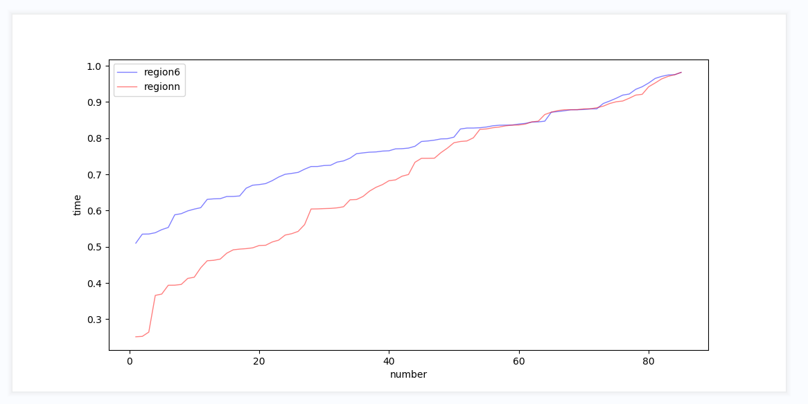
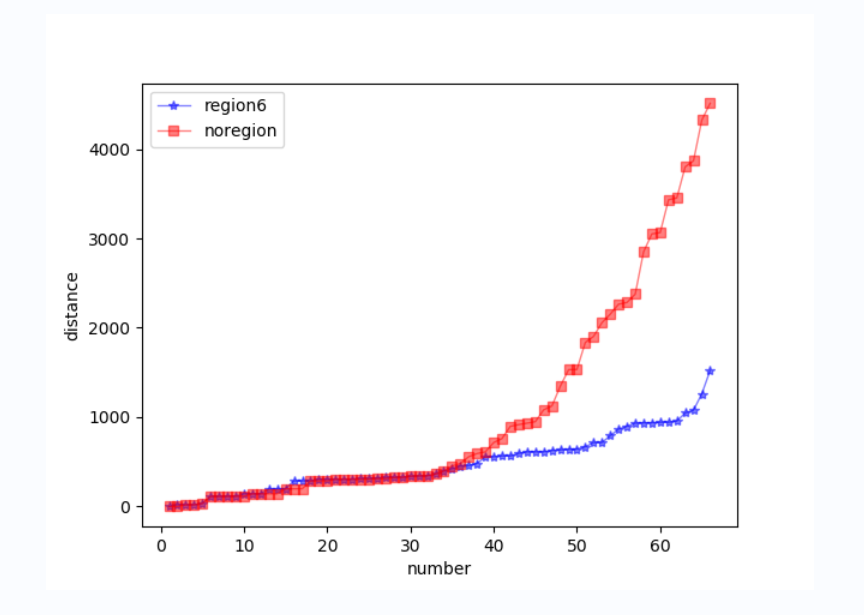
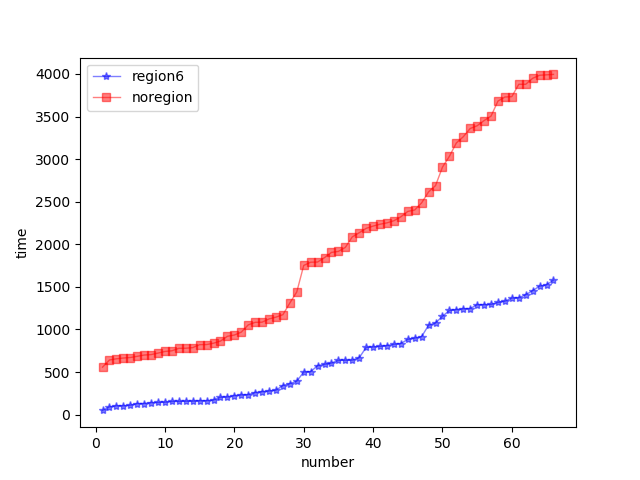

### 模拟道路的系统实验

4位GeoHash块南北长：19,546m，东西长：28,965.28m

5位GeoHash块南北长：4886.5m，东西长：3620.66m

6位GeoHash块南北长：610.8m，东西长：905.16m

7位GeoHash块南北长：152.7m，东西长：113.14m

**实验环境：**

- 14.5km *10.86km北京三环内模拟网格道路

- 30min内模拟500个车辆和700个乘客请求，初始化时刻为200车和200乘客，其余空车和乘客订单在30min内均匀发出

**数据收集：**

1. 相同乘客起止点的订单中，乘客打到车的响应时间，单位为ms（按region6的结果从小到大排序）：

​	可以观察到，基于地理位置区块链的6位区域调度（region6）的响应时间绝大部分更短。

2. 相同乘客起止点的订单中，车辆的载客时间占比（按region6的结果从小到大排序）：

两种环境下的载客时间占比没有明显优势。本次实验中，一部分路段过多的导航会超时，所以需要将乘客起止点加入合理的距离限制后重新做实验。

部分订单因为astar距离过长而超时。

后续工作：

乘客打不到车后，监听会同样接收消息，这样会出现报错。想办法处理打不到车的乘客（已处理）

测试astar多长的距离会超时，如果5位GeoHash范围内不会超时，则把起止点距离限定在5位范围内

passenger加passengerEnd字段

vehicle加vehicleId字段，vehiclePosition字段

4.23用1-2小时找到传统区块链支持的测试规模，在其测试规模范围内找到合适的对比

（初始化多少辆车，接受什么频率的乘客请求，先直接初始化调度，找到合适的车辆初始化值，从100车100乘客开始，2公里的直径，改变乘客的比率，测试两种区块链环境下的初始化接单率，找到都满单的状态，然后在都满单的初始化状态（高峰初始，平峰初始）下，用不同的乘客请求频数运行动态系统，对比两种环境下的各项数据），

对比在传统区块链状态下和区域调度状态下的各项收集数据的对比。

模拟高峰期乘客数量为车辆1.5倍的时刻，

传统区块链性能实验：

​							执行订单量       执行率

150车225乘 			1						0.67%

140车210乘			2						1.43%

130车195乘			3						2.31%

120车180乘			4						3.33%

110车165乘			8						7.27%

100车150乘			10					10.00%

90车135乘			  20					22.22%

80车120乘			  56					70.00%

70车105乘			  58					82.86%

60车90乘				57					95.00%

50车75乘				50					100.00%

40车60乘				40					100.00%

树状区块链性能实验：

​							执行订单量       执行率

150车225乘 			118						0.67%

140车210乘			105						1.43%

130车195乘			120						2.31%

120车180乘			110						3.33%

110车165乘			101						7.27%

100车150乘			93					10.00%

90车135乘			  88					22.22%

80车120乘			  75					70.00%

70车105乘			  66					82.86%

60车90乘				55					95.00%

50车75乘				47					100.00%

40车60乘				35					100.00%

考虑4000m * 5000m规模的交通小区：	

横轴为高峰期（乘客数量为车辆数量的1.5倍）初始时刻交通小区内初始化的车辆数目，纵轴为高峰期初始时刻乘客发出请求后，交通小区内接到订单的车辆的比率。在传统区块链中，乘客申请调度车辆时，区块链后台维护的车辆信息过多，查询时会发生超时现象，乘客呼叫车辆时无法得到响应。导致区域内车辆接单率不理想，上图在区域内初始化车辆数目为50左右时，传统区块链环境下的车辆接单率为100%，此时区域内所有乘客呼叫车辆不会发生超时。

​	树状区块链环境下，由于区块链后台可以快速查询乘客附近区域内的车辆账户，避免了过多无效的车辆信息查询，故响应性能相比传统区块链有提升，在区域内车辆分布较多时，树状区块链支持的系统，车辆的接单率平均保持在90%及以上的水平。交通小区内车辆分布数为180辆左右时，所有乘客的打车请求均不会超时。此时若乘客所在附近区域内有空车，乘客呼叫车辆的请求均会得到响应。

​	当交通小区内车辆较少时，由于部分乘客的邻居区域内没有可调度的空车，故在这一时刻的呼车请求没有得到及时的响应，但该交通小区内所有车辆的接单率仍保持在90%以上的水平。

​	树状区块链环境下，当区域内的车辆的数目超过200辆后，乘客呼叫出租车时区块链后台的响应会有超时，且区域内高峰期车辆数目越多，出现呼车超时现象的比例也就越多，导致区域内车辆的接单率下降。

下一步：用50车初始化环境，对比高峰期传统区块链与树状区块链的各项数值

**场景：**4000m * 5000m规模的区域，100辆车和150位乘客订单，模拟高峰期30min内的出行需求，初始时区域内有50车辆和75乘客

**车辆载客时间占比：**

**纵轴**为载客时间占车辆订单运行时间的比例；

**横轴**为两种环境下完成订单的同一批车辆个体；

蓝色为树状区块链环境下的区域调度，红色为传统区块链环境下的全局调度；

可以看到，在树状区块链环境下，车辆的载客时间占比更长的情况更多，这说明了区域调度会优化区域内车辆的运营效率，更有效地调度到距离乘客更近的车辆，让区域内乘客等车的时间减少。

**车辆接单时与乘客的距离：**

**纵轴**为距离，单位为米；

**横轴**为两种环境下完成订单的同一批乘客个体；

蓝色为树状区块链环境下的区域调度，红色为传统区块链环境下的全局调度；

可以看到，在树状区块链环境下，乘客匹配到的车辆距自己的距离会更短，这直观地说明了，在相同的环境下，区域调度会更有效地调度到距离乘客更近的车辆。

**乘客订单的响应时间：**

**纵轴**为时间，单位为毫秒；

**横轴**为两种环境下完成订单的同一批乘客个体；

蓝色为树状区块链环境下的区域调度，红色为传统区块链环境下的全局调度；

可以看到，在树状区块链环境下，乘客匹配到车辆的响应时间会更短，这说明在区域调度环境下，乘客打车的体验感会明显优化，验证了树状区块链进行区域调度的优越性。

**树状区块链性能实验：**

场景：

设置1倍区域为4km * 5km的规模，高峰期初始时有200辆车和300个乘客订单；

在不同倍数区域内，虽然每个乘客邻居区域内的车辆规模基本相同，但整体上所有乘客要跟同一个服务器节点交互，乘客请求的规模也会影响服务器的性能。

**纵轴**为高峰期车辆的接单率；

**横轴**为不同倍数的区域；

在1倍区域的规模时，乘客的邻居范围内有空闲车辆时，乘客的打车请求均会得到满足

在2倍区域的规模时，服务端接收到的请求规模翻倍，部分乘客的打车请求会响应超时，车辆的接单率也会因此降低。

当区域的规模继续扩大到3倍、4倍时，服务器超时的处理会增多，车辆的接单率降低。

给vehicle和加上time字段

1. 传统区块链和树状区块链的两种环境不对等，传统区块链环境下的响应会超时，传统区块链进行车辆调度的实验无法继续。

在传统区块链能支持的环境中去做对比试验。（能做多大用多大的数据）

2. 实验内容，按已有的方案能做的做，不能做的记下来再考虑要不要做。模拟数据的实验主要是考虑程序是否出问题。

 

车辆在两个订单之间的空车时间？

统计：

1. 被接单率
2. 车辆载客时间、占比
3. 乘客打车的响应时间，

现象：在60个乘客同时发起打车请求后，全局查询算法最多能维护16 * 9 = 144辆车的遍历查询，超过144辆则会返回结果超时，这在一方面说明了在区块链系统中加入地理信息的优势。
