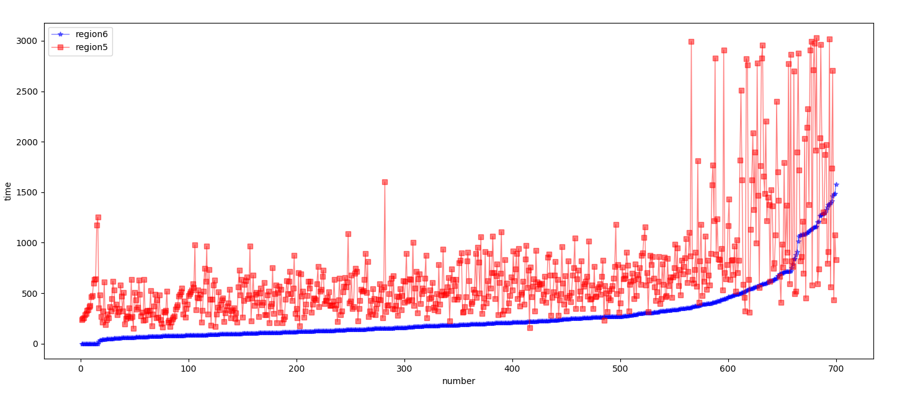
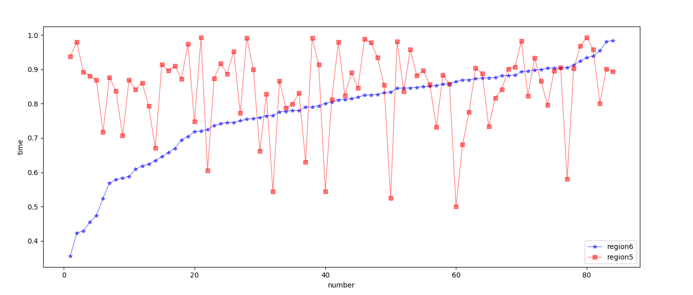
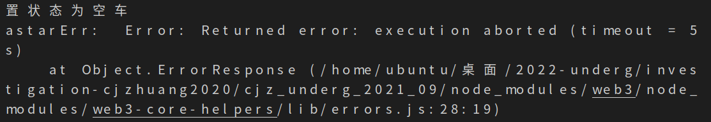

### 模拟道路的系统实验

5位GeoHash块南北长：4886.5m，东西长：3620.66m

6位GeoHash块南北长：610.8m，东西长：905.16m

7位GeoHash块南北长：152.7m，东西长：113.14m

**实验环境：**

- 14.5km *10.86km北京三环内模拟网格道路

- 30min内模拟500个车辆和700个乘客请求，初始化时刻为200车和200乘客，其余空车和乘客订单在30min内均匀发出

**数据收集：**

1. 相同乘客起止点的订单中，乘客打到车的响应时间（按region6的结果从小到大排序）：

​	可以观察到，基于地理位置区块链的6位区域调度（region6）的响应时间绝大部分更短。

2. 相同乘客起止点的订单中，车辆的载客时间占比（按region6的结果从小到大排序）：

两种环境下的载客时间占比没有明显优势。本次实验中，一部分路段过多的导航会超时，所以需要将乘客起止点加入合理的距离限制后重新做实验。

部分订单因为astar距离过长而超时。

后续工作：

乘客打不到车后，监听会同样接收消息，这样会出现报错。想办法处理打不到车的乘客

测试astar多长的距离会超时，如果5位GeoHash范围内不会超时，则把起止点距离限定在5位范围内

统计：

1. 被接单率
2. 车辆载客时间、占比
3. 乘客打车的响应时间，

