### 模拟道路的系统实验

4位GeoHash块南北长：19,546m，东西长：28,965.28m

5位GeoHash块南北长：4886.5m，东西长：3620.66m

6位GeoHash块南北长：610.8m，东西长：905.16m

7位GeoHash块南北长：152.7m，东西长：113.14m

**实验环境：**

- 14.5km *10.86km北京三环内模拟网格道路

- 30min内模拟500个车辆和700个乘客请求，初始化时刻为200车和200乘客，其余空车和乘客订单在30min内均匀发出

**数据收集：**


后续工作：

乘客打不到车后，监听会同样接收消息，这样会出现报错。想办法处理打不到车的乘客（已处理）

测试astar多长的距离会超时，如果5位GeoHash范围内不会超时，则把起止点距离限定在5位范围内


（初始化多少辆车，接受什么频率的乘客请求，先直接初始化调度，找到合适的车辆初始化值，从100车100乘客开始，2公里的直径，改变乘客的比率，测试两种区块链环境下的初始化接单率，找到都满单的状态，然后在都满单的初始化状态（高峰初始，平峰初始）下，用不同的乘客请求频数运行动态系统，对比两种环境下的各项数据），


对比在传统区块链状态下和区域调度状态下的各项收集数据的对比。


**考虑4000m * 5000m规模的交通小区：**

模拟高峰期乘客数量为车辆1.5倍的时刻，对比传统区块链和树状区块链环境下的性能


传统区块链性能实验：

​							执行订单量       执行率

150车225乘 			1						0.67%

140车210乘			2						1.43%

130车195乘			3						2.31%

120车180乘			4						3.33%

110车165乘			8						7.27%

100车150乘			10					10.00%

90车135乘			  20					22.22%

80车120乘			  56					70.00%

70车105乘			  58					82.86%

60车90乘				57					95.00%

50车75乘				50					100.00%

40车60乘				40					100.00%


树状区块链性能实验：

​							执行订单量       执行率

150车225乘 			118						0.67%

140车210乘			105						1.43%

130车195乘			120						2.31%

120车180乘			110						3.33%

110车165乘			101						7.27%

100车150乘			93					10.00%

90车135乘			  88					22.22%

80车120乘			  75					70.00%

70车105乘			  66					82.86%

60车90乘				55					95.00%

50车75乘				47					100.00%

40车60乘				35					100.00%


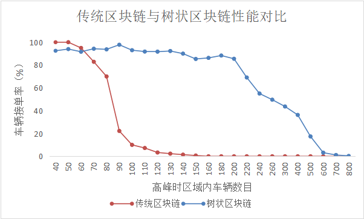


横轴为高峰期（乘客数量为车辆数量的1.5倍）初始时刻交通小区内初始化的车辆数目，纵轴为高峰期初始时刻乘客发出请求后，交通小区内接到订单的车辆的比率。在传统区块链中，乘客申请调度车辆时，区块链后台维护的车辆	息过多，查询时会发生超时现象，乘客呼叫车辆时无法得到响应。导致区域内车辆接单率不理想，上图在区域内初始化车辆数目为50左右时，传统区块链环境下的车辆接单率为100%，此时区域内所有乘客呼叫车辆不会发生超时。

​	树状区块链环境下，由于区块链后台可以快速查询乘客附近区域内的车辆账户，避免了过多无效的车辆信息查询，故响应性能相比传统区块链有提升，在区域内车辆分布较多时，树状区块链支持的系统，车辆的接单率平均保持在90%及以上的水平。交通小区内车辆分布数为180辆左右时，所有乘客的打车请求均不会超时。此时若乘客所在附近区域内有空车，乘客呼叫车辆的请求均会得到响应。

​	当交通小区内车辆较少时，由于部分乘客的邻居区域内没有可调度的空车，故在这一时刻的呼车请求没有得到及时的响应，但该交通小区内所有车辆的接单率仍保持在90%以上的水平。

​	树状区块链环境下，当区域内的车辆的数目超过200辆后，乘客呼叫出租车时区块链后台的响应会有超时，且区域内高峰期车辆数目越多，出现呼车超时现象的比例也就越多，导致区域内车辆的接单率下降。


下一步：用50车初始化环境，对比高峰期传统区块链与树状区块链的各项数值

**场景：**4000m * 5000m规模的区域，100辆车和150位乘客订单，模拟高峰期30min内的出行需求，初始时区域内有50车辆和75乘客


**车辆载客时间占比：**

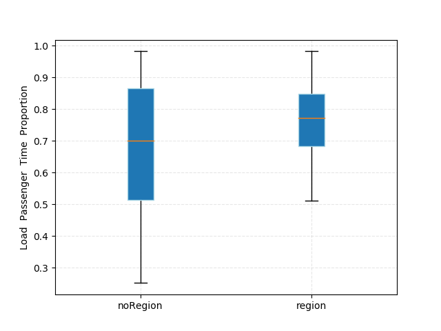

**纵轴**为载客时间占车辆订单运行时间的比例；

**横轴**为两种环境下完成订单的同一批车辆个体；


可以看到，在树状区块链环境下，车辆的载客时间占比更长的情况更多，这说明了区域调度会优化区域内车辆的运营效率，更有效地调度到距离乘客更近的车辆，让区域内乘客等车的时间减少。

容易导致误判，错认为系统优化了20%


**车辆接单时与乘客的距离：**

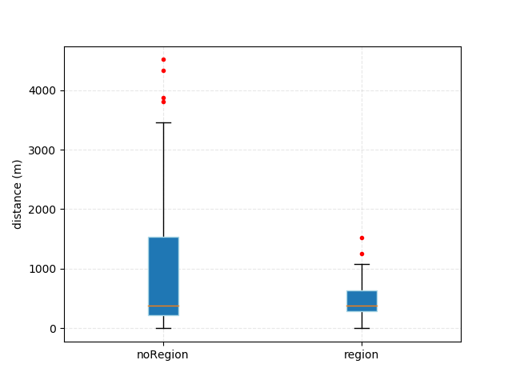

**纵轴**为距离，单位为米；

**横轴**为两种环境下完成订单的同一批乘客个体；


可以看到，在树状区块链环境下，乘客匹配到的车辆距自己的距离会更短，这直观地说明了，在相同的环境下，区域调度会更有效地调度到距离乘客更近的车辆。


**乘客订单的响应时间：**

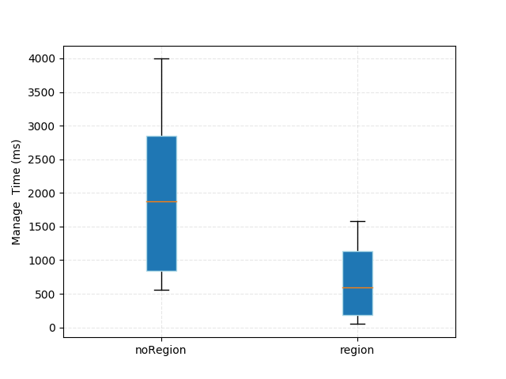

**纵轴**为时间，单位为毫秒；

**横轴**为两种环境下完成订单的同一批乘客个体；


可以看到，在树状区块链环境下，乘客匹配到车辆的响应时间会更短，这说明在区域调度环境下，乘客打车的体验感会明显优化，验证了树状区块链进行区域调度的优越性。


调度车辆的gas消耗：

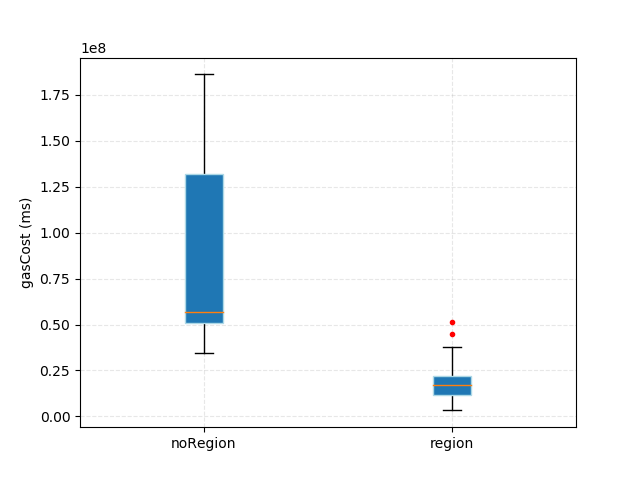


**树状区块链性能实验：**

场景：

设置1倍区域为4km * 5km的规模，高峰期初始时有200辆车和300个乘客订单；

在不同倍数区域内，虽然每个乘客邻居区域内的车辆规模基本相同，但整体上所有乘客要跟同一个服务器节点交互，乘客请求的规模也会影响服务器的性能。

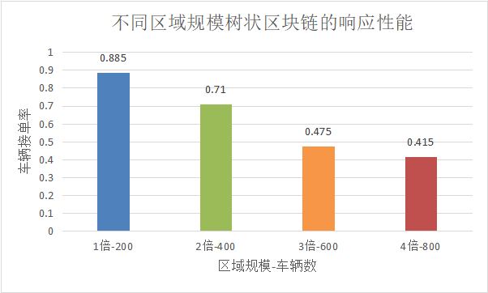

**纵轴**为高峰期车辆的接单率；

**横轴**为不同倍数的区域；

在1倍区域的规模时，乘客的邻居范围内有空闲车辆时，乘客的打车请求均会得到满足

在2倍区域的规模时，服务端接收到的请求规模翻倍，部分乘客的打车请求会响应超时，车辆的接单率也会因此降低。

当区域的规模继续扩大到3倍、4倍时，服务器超时的处理会增多，车辆的接单率降低。


做实验验证不能做出解释的部分


在传统和树状区块链上对比：并发请求数超过60个，传统区块链就会超时而没有结果了；

树状区块链的容量会是它的3倍多。

第二张图很容易让人误解；


测试服务器负载的实验：线性下降是有些无法解释的；

真实地图的对比实验

真实地图的运行实验

 


**树状区块链性能实验（平时、高峰）**


在4km * 5km的区域范围内，初始化200车和300乘客，模拟2小时的高峰期出行环境，2小时共运行800车和1200乘客。

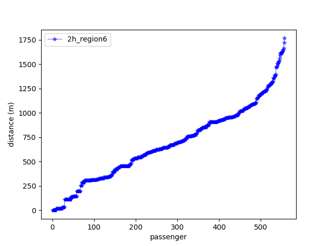

2小时内，呼叫到出租车的乘客，其距离车辆的距离最大为1750m左右，80%以上的车辆与乘客的距离在200m-1200m的范围内，乘客调度出租车的合理距离范围。

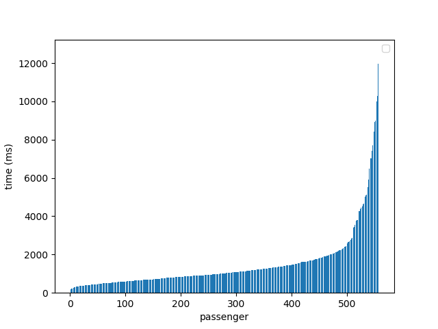

2h系统中，乘客呼叫出租车的响应时间，绝大部分在4s以内，最大响应时间不超过12s。


搞出总结和致谢

补完第五章系统实验部分

插公式

插图

做实验获得图


# 20220311-对成佳壮学位论文前三章的修改意见

成佳壮的学位论文前三章的[当前版本](https://github.com/Wintersweet0/master-thesis/blob/d9501dbbe0aa80e40b428e0a2736b15c7f42f011/BIT-thesis-manual/manual.pdf)

## 摘要

1. 请注意确认，在摘要中描述的论文贡献在正文中都有相应的数据支撑。如“车辆信誉数据的安全性、可溯性和在网络内的同步性”

## 第一章

1. 在论文描述中需要随时确认自己的描述是表达准确和逻辑严谨的。如1.1节中的“它不能被伪造，所以更安全”，它后面说的都是不可篡改。
2. 1.2节中描述相关工作时，可以把关于自己工作描述集中到一起，放在最后，单独成为一段；而不是分散到许多段落中。如第一段的最后一句、最后一段的最后一句。
3. 全文用词要尽可能一致。如“基于以太坊的树状区块链”和“基于树状区块链”。
4. 1.3.1和1.3.2节的内容需要协调一致。“研究内容”是说“你要在论文中讨论什么事”，“贡献”是要说“你做出的结果或你做到什么程度”。它们是很区别的，不能混淆。
5. 我认为你的论文贡献可归纳成以下几条：1）引入支持GeoHash位置表示的树状区块链；2）在智能合约中设计并实现了出租车调度系统原型，包括导航算法、车乘匹配算法和基于Leaflet的应用前端。3）通过模拟实验优化了算法参数，验证了调度系统的特征。

## 第二章

1. 开头：为什么要说“基于 GeoHash 的路径规划算法设计”？
2. 2.1.1节中的“传统区块链技术整个网络同时只有一条单链”是不对的。
3. 2.1.2节中的“上述两类区块链研究没有考虑到地理因素”：在周畅的调研中找到若干篇用了位置信息的区块链。你可以补充一下。
4. 2.1节最后一段的GeoHash描述，好像有些不连贯。我感觉把2.2节放在区块链综述的前面会好一些。
5. 2.2节的标题“矢量地图研究”不好，可以改成“矢量地图”。
6. 2.2节的三级小节顺序需要调整。我建议的顺序是，GeoHash位置表示、矢量地图表示、地图对象检索和地图渲染。相当于是，最后周畅做的基于GeoHash的Leaflet用来作为你的调度系统前端。
7. 2.3节的调度系统综述：需要补充传统调度系统的功能综述，这是你的调度系统要实现的功能。有了这些功能，你才能算是一个调度系统。
8. 第二章的最后加一个本章内容的小结吧。小结的目的是，基于调研结果，你选择周畅树状区块链和支持GeoHash的Leaflet作为你的基础来构建出租车调度应用系统原型。第三章也需要类似的处理。

## 第三章

1. 全文的描述要注意行文的简洁和流畅。如第三章开头的“本章介绍了本文所实现系统的...”就比较啰嗦和没有内容，“了本文”可以不要，“所实现系统”可以改成“调度系统”。
2. 图3.1还要仔细推敲。前端与后台间的两个箭头也应该是双向的；合约与区块链存储的交互、前端与后台的交互：这两个交互目前的表示不清晰。
3. 3.1节需要补充一节，描述整个系统分几块，每块的功能是什么、各块间的交互信息方向和内容是什么。然后，你的3.1.1和3.1.2才要理解。
4. 目前3.1.1节和3.1.2节的模块功能描述基本上是一个处理流程描述。在这里应该每个模块的功能是什么和与外部的交互信息是什么。
5. 3.3节的“测试框架”可以放到第五章。

## 总体意见

1. 从内容来看，是比较充实的。
2. 从写作的角度来看，各部分的目标和相互间的逻辑关系还有待梳理。
3. 你先看过前三章的意见，可以不着急立即修改。在写后续章节时需要注意减少和避免类似问题。完整写完一稿后，再回头来依据改进效果和可用时间来安排修改顺序。
4. 看过上述反馈意见后，与我约时间交流，以确认你的理解与我的表达是一致的。


## 对成佳壮学位论文第四和五章的修改意见

### 第四章

1. 标题不好。这一章的内容是基于第三章的框架给出你的实现。读者无法从这个标题得到关于这一章内容的有意义信息。请全面检查所有章节的标题，尽力让标题能概括对应章节的内容，给读者有意义的信息。（最后浏览文章的时候再改一下）
2. 4.1.1节的主要内容是描述，只有最后一句是与道路信息在区块链上存储相关。这个标题太强调最后一句的内容了。
3. 4.1.2节的描述有些逻辑不清晰。没有说清楚屏幕像素位置与GeoHash的转换过程。建议你把重点放在描述这个转换过程上，并简洁地表达清楚。4.1.3节的两个算法还是在说这个转换过程，对放缩和拖动算法的描述也不是很清楚。建议把重点放在放缩和拖动算法的描述上。（4.1.2讲的是把GeoHash投影成屏幕点，4.1.3讲的是把屏幕点还原成GeoHash）
4. 4.2.1节的距离计算原理描述没有说清楚。我对这个距离计算优化的表达是，用数格子和查表来简化近似的距离计算。
5. 4.3.1节的调研需要给一个结论，你选择用合约实现哪个算法。
6. 4.3.2节是你的论文的核心算法，需要更详细地描述你的实现，并与前面的章节相呼应。这一节，你综合运用了前面若干章节内容的结果。是这样吧？
7. 4.4.1节可以放到第二章中。建议在这里给一个简短的介绍，然后说明你如何把它用到你的调度系统中。
8. 4.4.2节也你的论文的重点算法。对算法的描述，需要更严谨一些。用合约实现这个算法也是可以好好说的，建议适当补充。
9. 建议加一节描述调度系统的业务流程。乘客和司机登录系统；乘客发请求，系统匹配和通知司机，司机应答后接乘客；系统规划路径后，司机送乘客到目的地；最后完成支付操作。（第三章有业务流程）
10. 每一章的最后需要一个“小结”，总结本章的结果。（√）

### 第五章

1. 开头需要一节较详细地描述实验场景、实验内容和统计数据等背景信息，以方便读者了解后面的数据和分析在说什么。
2. 请检查所有曲线图的坐标含义和单位是否标注明确。
3. 与图5.12类似的几个图占地方太大，有些灌水的嫌疑。

### 结论

1. 摘要和结论的写法是，要相互一致和呼应，各有侧重，并且与正文各章节相一致。不能各写各的。
2. 我对你的论文贡献的描述是，1）基于GeoHash用合约实现了匹配算法和路径规划算法；2）设计和实现了一个基于树状区块链的出租车调度原型系统；3）通过模拟数据实验验证了原型系统的可行性和基本性能特征。
3. 后续工作可以写成一段，不用列编号。
4. 请依据上述意见，修改摘要、结论、各章的开头和小结，希望形成一个有机的整体。


## 向勇的修改意见

1. 摘要：你的工作与车载自组网关系不大，背景描述应该说智能交通、车联网和区块链。需求是去中心化和地理信息的隐私保护。结论中的第一段的套路就好一些。
2. 摘要：你的工作是在树状区块链上实现了一个出租车调度系统。这要单独成为一段。
3. 1.3.2节与摘要和结论的呼应关系还需要改进。摘要中没说Leaflet的事儿，但另外两个部分都放在第一条了。
4. 3.4节的小结表述需要调整一下，不用第xx节说了些什么，而是说这一章可以得到的结果。如这一章的结论是，设计了调度系统的结构，前端基于Leaflet，后端是树状区块链上的车乘匹配和路径规划；然后梳理了调度系统的业务流程。5.6节的内容也有类似情况。
5. 第四章标题改成“出租车调度系统实现”。如何？
6. 感觉把4.2和4.1对调一下，更合理些。
7. 注意文字描述的流畅性。如“已经均被介绍”。
8. 第5章开头中关于上一章内容的描述可以不要。
9. 完成上述修改后，联络我交流修改情况。


版本还不是完全

担心这种情况，优先把实验补完

协调各部分需要更多时间，先把所有缺的部分补全，现有意见只是写的时候做参考，该有的东西全有了再开始搞。

部分参考文献是问号

抓大方向

第四章第五章没有结尾

摘要和各章开头、结尾，审稿人根据摘要去对应的章节看工作，摘要说的事情要在论文里有支撑，在不同的章节都有支撑，最后在总结里详细介绍，


论文的行文上并没有对调度系统重要说明，前端的部分没有弄成一个章节，审稿人找的时候比较困难。

后端基于区块链，但后端主要在描述GeoHash，区块链有什么区别呢？


1. 把不全的地方全部补全，把主要精力放在补全实验上
2. 修改重点是各个部分之间的协调，把这部分挪到那部分
3. 摘要里描述的哪一章的部分，要在每一章都能找得到，在开头和结尾小节都要有体现（找到相应证据）


GeoHash是减少运算开销和时间开销，


5.2

获得车乘匹配实验的数据图

diao


WARN [04-26|08:40:59.078] Served eth_sendTransaction               reqid=1520  t=216.483912ms  err="exceeds block gas limit"


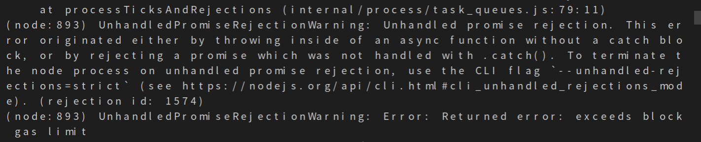

给vehicle和加上time字段


1. 传统区块链和树状区块链的两种环境不对等，传统区块链环境下的响应会超时，传统区块链进行车辆调度的实验无法继续。

在传统区块链能支持的环境中去做对比试验。（能做多大用多大的数据）


2. 实验内容，按已有的方案能做的做，不能做的记下来再考虑要不要做。模拟数据的实验主要是考虑程序是否出问题。


rm -rf .navicat64/

```sql
select row_to_json(t)
from (select gid, tag_id, name, round(cost::numeric,0) as cost, round(reverse_cost::numeric,0) as reverse_cost, x1,y1,x2,y2, one_way, source, target, ST_AsText(the_geom) as path from ways where (((x1 between 116.317038 and 116.373257) and (y1 between 39.994394 and 39.942888)) or ((x2 between 116.317038 and 116.373257) and (y2 between 39.994394 and 39.942888))) and (tag_id = 109 or tag_id = 106 or tag_id = 107 or tag_id = 124 or tag_id = 125 or tag_id = 108) and one_way = 1 order by gid) AS t;
```

找到wx4er（4000 * 5000m）区域内的道路数据

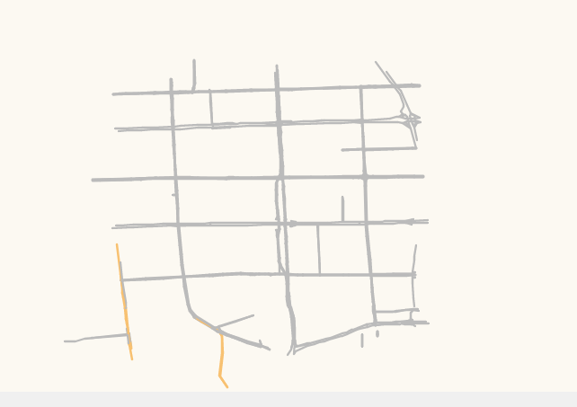

筛选路口位置：

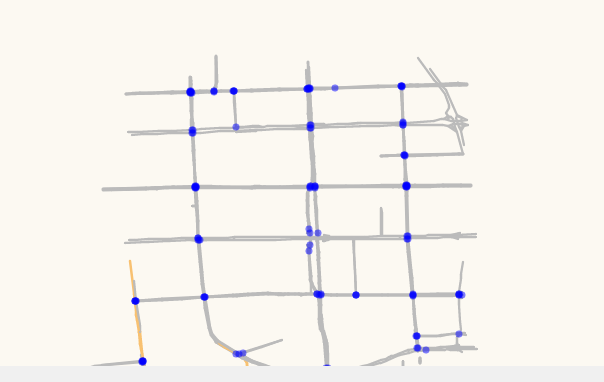

交通小区内30min实验，传统与树状区块链统计数据作对比

**实验结果：**


车辆和乘客距离：

​	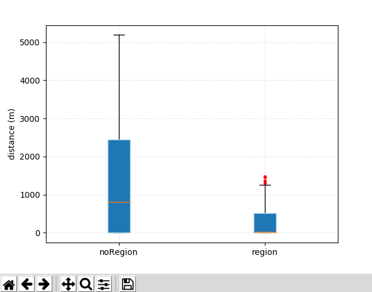

响应时间：

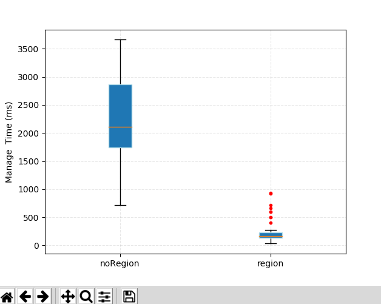

gas消耗：

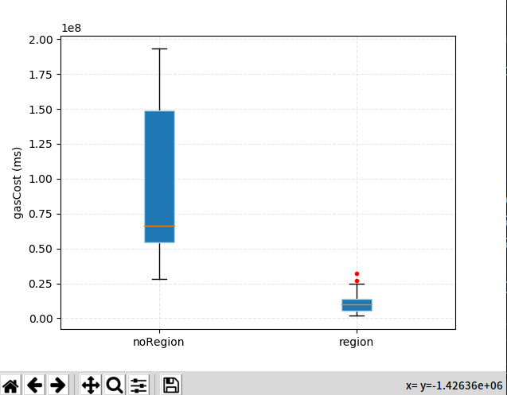


1. 树状区块链环境下的系统性能测试，从多小的区域做到多大的区域，从最少多少辆车做到最多多少辆车？
   1. 4km * 5km范围，200辆车，可以做密集请求实验
   2. 10km * 10km范围，请求规模不能太密集
2. 真实地图数据做到多大规模？


5.5树状区块链性能实验

真实数据30min实验

真实数据大范围2h实验


本部分旨在探究一个地理位置区块链服务节点并发处理乘客打车请求的能力，实验设置了8 * 10km的区域，初始化1000辆空车，在区域内维护足够多的车辆，目的是保证每个乘客造6位邻居区域调度时都能够匹配到车辆。探究区块链节点能够并发处理的乘客请求规模：


| 1000辆车 | 乘客数量 | 完成单量 | 未完成单量 |
| -------- | -------- | -------- | ---------- |
|          | 50       | 50       | 0          |
|          | 60       | 60       | 0          |
|          | 70       | 70       | 0          |
|          | 80       | 80       | 0          |
|          | 90       | 90       | 0          |
|          | 100      | 100      | 0          |
|          | 110      | 110      | 0          |
|          | 120      | 120      | 0          |
|          | 130      | 130      | 0          |
|          | 140      | 140      | 0          |
|          | 150      | 150      | 0          |
|          | 160      | 160      | 0          |
|          | 170      | 170      | 0          |
|          | 180      | 180      | 0          |
|          | 190      | 190      | 0          |
|          | 200      | 200      | 0          |
|          | 210      | 210      | 0          |
|          | 220      | 215      | 5          |
|          | 230      | 221      | 9          |
|          | 240      | 227      | 13         |
|          | 250      | 235      | 15         |
|          | 260      | 238      | 22         |
|          | 270      | 250      | 20         |
|          | 280      | 246      | 34         |
|          | 290      | 234      | 56         |
|          | 300      | 254      | 46         |
|          | 310      | 263      | 47         |
|          | 320      | 247      | 73         |
|          | 330      | 267      | 63         |
|          | 340      | 280      | 60         |
|          | 350      | 287      | 63         |
|          | 360      | 298      | 62         |
|          | 370      | 318      | 52         |
|          | 380      | 329      | 51         |
|          | 390      | 334      | 56         |
|          | 400      | 311      | 89         |
|          | 500      | 285      | 215        |
|          | 600      | 348      | 252        |
|          | 700      | 321      | 379        |
|          | 800      | 355      | 445        |


5.6号

1. 50辆车、75乘客，小范围高峰期区域调度，传统与树状对比实验——真实道路。

​		树状：84单  传统：97单

2. 200辆车，300乘客，树状区块链，模拟2h交通小区的出行请求，统计数据。

​		共执行了770个订单

3. 整理树状区块链性能实验的数据，想办法把数据展示好。


1. 整理图片格式
2. 添加图片，修改图片描述，给向老师发过去
3. 增加章节的总结，改摘要


5.10号

改第五章实验图片，用python画一下，改横轴

改附录和符号标记的部分

把[周畅论文]改掉

看一下全文的图的单位

看一看第一章的贡献部分和各章的标题、小结

纵观一下，看还有什么问题

改摘要

在grdms网站录入学位论文信息（√）

思想汇报和半年总结


In-vehicle ad hoc network is an open network constructed among traffic environment participants, which can provide users with decentralized data transmission capabilities. Based on the in-vehicle ad hoc network, applications such as accident warning, assisted driving, road traffic information query, inter-vehicle communication and network access services can be realized. The development of these applications requires the support of geographic information and traffic data, but the monopoly of information will lead to unfair profit-making and vicious competition. In response to this problem, this paper develops a taxi dispatching system based on the GeoHash vector map and geographic location blockchain platform to complete the decentralized management of taxi dispatching. First of all, this paper selects GeoHash as the unified location information representation method in the system. At the same time, this work optimizes the distance calculation of GeoHash on geographic information in the smart contract. After that, this paper adopts the combination of terminal and blockchain server to realize the scheduling system. Among them, the path planning algorithm based on GeoHash map data and the regional scheduling algorithm of vehicles are developed on the blockchain server, which solves the problem of concurrency conflicts in the allocation of vehicles and passengers, and realizes the maintenance of information of vehicles and passengers and the integration of ride-hailing services at the terminal. Complete process design. Finally, the optimization of the distance calculation is experimentally verified in this work, and the key parameters of the path planning algorithm are adjusted to ensure the accuracy and efficiency of the system function. Finally, the system operation experiments on simulated roads and real roads are carried out to verify the availability of the taxi dispatching system. The system in this paper makes full use of the properties of GeoHash geographic information and geographic location blockchain to ensure the security of traffic data and the efficiency of services, and proves the integration of GeoHash geographic information and geographic location blockchain into vehicle ad hoc network applications. feasibility.


% 可以观察到，所有乘客进行6位区域调度的响应时间均明显低于全局调度的响应时间。

% 不同位置乘客，其进行全局调度请求的响应时间区别较大。这是因为，查找距离乘客最近的空车时，全局调度需要遍历的车辆较多，若后台未能先找到距离乘客较近的车辆，那么后续找到更近距离的空车后，会多次更改智能合约内部的数据状态，导致响应时间延长。故不同位置的乘客进行全局调度请求时，系统的响应时间区别较大。

% 相比全局调度，相同乘客进行6位区域调度的响应时间低于全局调度的比例为100$\%$，这说明了在出租车调度系统中应用地理位置区块链的正确性和有效性。

% 可以观察到，每个乘客在两种环境下的调度请求结果，有时是全局调度的车辆更远，有时是区域调度的车辆更远，但二者绝大部分的距离结果相差并不大（平均起来，每位乘客与其匹配到的车辆的距离，在6位GeoHash的区域调度时，只比全局调度远$\%$。

% 但值得注意的是，全局调度中会有乘客匹配到明显较远的车辆，其距离是乘客平均等车距离的7.63倍、6.23倍，让少数乘客付出了更多的等待时间。这说明，相比全局调度而言，区域调度能保证匹配到的出租车不会距离乘客太远，从而提高了所有乘客的打车体验，同时还能保持平均调度距离不明显增加。

% 但区域调度显著降低了系统的响应时间，同时保证了所有乘客的打车体验，证明了地理位置区块链的应用相比传统区块链具有明显优势。

% 但基于6位GeoHash的区域调度也有易见的缺点：将可选车辆的范围限制在了6位GeoHash区域的范围内，如果乘客的位置在6位GeoHash区域的边缘，则在该6位区域外的相邻区域可能有比原区域内距离乘客更近的空车。


% \section{数据分析工作}

% 1. 出租车GPS数据字段包括是否载客的状态，利用对出租车是否载客的分析可以得到出租车的分布特点和乘客的分布特点。

% 2. 分析真实的出租车数据，讨论不同时段的车辆和乘客在城区的分布情况（既考虑了时间因素也考虑了位置因素），依此设置空车和乘客的初始化位置和比例，为下一步系统仿真测试做铺垫。

% \section{系统测试实验}

% 展示近距离路径规划和远距离路径规划的路径

% \subsection{真实地图数据测试}

% 真实地图的路径规划结果测试。

% 收集数据：

% 1. 在不同环境下（请求频繁或者稀疏）乘客平均等待时间、车辆平均空车时间（即处于未载客状态的时间），或者百分率，验证区域调度相比全局调度的优越性，系统将区块链与地理信息结合是有意义的。

% 2. 在不同环境下（请求频繁或者稀疏）系统对乘客请求的响应时间，响应时间在一定阈值范围内，可验证系统的合理性和正确性。


统计：

1. 被接单率
2. 车辆载客时间、占比
3. 乘客打车的响应时间，


现象：在60个乘客同时发起打车请求后，全局查询算法最多能维护16 * 9 = 144辆车的遍历查询，超过144辆则会返回结果超时，这在一方面说明了在区块链系统中加入地理信息的优势。
