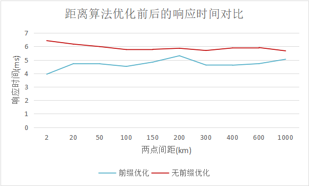
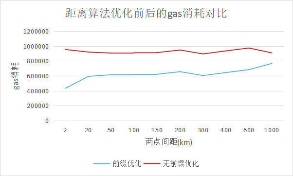

实验一：

前缀匹配算法计算结果的优化效率：（10位长度）

1. 响应速度
2. gas消耗
3. 计算结果是否相同

实验步骤：

在智能合约实现普通距离计算和前缀匹配计算

测试2km、4km、6km、8km、......、20km的距离计算，测1000次取平均值


距离采用10位GeoHash进行计算

call函数返回不了gas消耗的情况，利用gasleft()在智能合约内部实现gas消耗的计算

前缀优化实验的自动化测试代码已完成

**2km——20km的规模：**

```
//前缀优化，区块链环境
records:  [
  {
    distanceScale: 2000,
    aveGas: 432160,
    aveTime: 3.826,
    aveDistance: 1999.8486141396543
  },
  {
    distanceScale: 4000,
    aveGas: 550370,
    aveTime: 4.321,
    aveDistance: 4001.8135830126416
  },
  {
    distanceScale: 6000,
    aveGas: 570926,
    aveTime: 4.258,
    aveDistance: 6000.153360652799
  },
  {
    distanceScale: 8000,
    aveGas: 492594,
    aveTime: 3.944,
    aveDistance: 7999.469003177946
  },
  {
    distanceScale: 10000,
    aveGas: 558900,
    aveTime: 4.305,
    aveDistance: 10000.44161137998
  },
  {
    distanceScale: 12000,
    aveGas: 597714,
    aveTime: 4.354,
    aveDistance: 12001.845272608596
  },
  {
    distanceScale: 14000,
    aveGas: 554332,
    aveTime: 4.152,
    aveDistance: 14000.596874942472
  },
  {
    distanceScale: 16000,
    aveGas: 643450,
    aveTime: 4.465,
    aveDistance: 15999.397963911197
  },
  {
    distanceScale: 18000,
    aveGas: 597756,
    aveTime: 4.223,
    aveDistance: 18001.145942278552
  },
  {
    distanceScale: 20000,
    aveGas: 593188,
    aveTime: 4.199,
    aveDistance: 20001.20161836259
  }
]
```


```
//无前缀优化，区块链环境
records:  [
  {
    distanceScale: 2000,
    aveGas: 954728,
    aveTime: 6.133,
    aveDistance: 1999.8486141396543
  },
  {
    distanceScale: 4000,
    aveGas: 954742,
    aveTime: 6.14,
    aveDistance: 4001.8135830126416
  },
  {
    distanceScale: 6000,
    aveGas: 975298,
    aveTime: 6.116,
    aveDistance: 6000.153360652799
  },
  {
    distanceScale: 8000,
    aveGas: 819902,
    aveTime: 5.33,
    aveDistance: 7999.469003177946
  },
  {
    distanceScale: 10000,
    aveGas: 886208,
    aveTime: 5.594,
    aveDistance: 10000.44161137998
  },
  {
    distanceScale: 12000,
    aveGas: 925022,
    aveTime: 5.963,
    aveDistance: 12001.845272608596
  },
  {
    distanceScale: 14000,
    aveGas: 881640,
    aveTime: 5.598,
    aveDistance: 14000.596874942472
  },
  {
    distanceScale: 16000,
    aveGas: 970758,
    aveTime: 5.963,
    aveDistance: 15999.397963911197
  },
  {
    distanceScale: 18000,
    aveGas: 925064,
    aveTime: 5.783,
    aveDistance: 18001.145942278552
  },
  {
    distanceScale: 20000,
    aveGas: 920496,
    aveTime: 5.689,
    aveDistance: 20001.20161836259
  }
]
```


**2km——1000km的规模：**

```
//前缀优化，区块链环境
records:  [
  {
    distanceScale: 2km,
    aveGas: 432160,
    aveTime: 3.941,
    aveDistance: 1999.8486141396543
  },
  {
    distanceScale: 20km,
    aveGas: 593188,
    aveTime: 4.716,
    aveDistance: 20001.20161836259
  },
  {
    distanceScale: 50km,
    aveGas: 615320,
    aveTime: 4.71,
    aveDistance: 50131.88414013138
  },
  {
    distanceScale: 100km,
    aveGas: 619940,
    aveTime: 4.518,
    aveDistance: 99008.55263416468
  },
  {
    distanceScale: 150km,
    aveGas: 622158,
    aveTime: 4.839,
    aveDistance: 153319.01822553767
  },
  {
    distanceScale: 200km,
    aveGas: 656470,
    aveTime: 5.309,
    aveDistance: 202197.16085230376
  },
  {
    distanceScale: 300km,
    aveGas: 603928,
    aveTime: 4.619,
    aveDistance: 301769.8915047302
  },
  {
    distanceScale: 400km,
    aveGas: 645040,
    aveTime: 4.608,
    aveDistance: 400431.5518141399
  },
  {
    distanceScale: 600km,
    aveGas: 683910,
    aveTime: 4.723,
    aveDistance: 604100.0865083536
  },
  {
    distanceScale: 1000km,
    aveGas: 767840,
    aveTime: 5.049,
    aveDistance: 1007793.3422708587
  }
]
```


```
//无前缀优化
records:  [
  {
    distanceScale: 2km,
    aveGas: 954728,
    aveTime: 6.428,
    aveDistance: 1999.8486141396543
  },
  {
    distanceScale: 20km,
    aveGas: 920496,
    aveTime: 6.173,
    aveDistance: 20001.20161836259
  },
  {
    distanceScale: 50km,
    aveGas: 906712,
    aveTime: 5.988,
    aveDistance: 50131.88414013138
  },
  {
    distanceScale: 100km,
    aveGas: 911332,
    aveTime: 5.767,
    aveDistance: 99008.55263416468
  },
  {
    distanceScale: 150km,
    aveGas: 913550,
    aveTime: 5.785,
    aveDistance: 153319.01822553767
  },
  {
    distanceScale: 200km,
    aveGas: 947862,
    aveTime: 5.864,
    aveDistance: 202197.16085230376
  },
  {
    distanceScale: 300km,
    aveGas: 895320,
    aveTime: 5.699,
    aveDistance: 301769.8915047302
  },
  {
    distanceScale: 400km,
    aveGas: 936432,
    aveTime: 5.888,
    aveDistance: 400431.5518141399
  },
  {
    distanceScale: 600km,
    aveGas: 975302,
    aveTime: 5.916,
    aveDistance: 604100.0865083536
  },
  {
    distanceScale: 1000km,
    aveGas: 909052,
    aveTime: 5.671,
    aveDistance: 1007793.3422708587
  }
]
```


2km、20km、50km、100km、150km、200km、300km、400km、600km、1000km







1. 前缀匹配算法会带来运算效率的优化，在响应时间和gas消耗方面均有体现
2. 原算法GeoHash计算距离的速度与两点之间距离的大小不直接相关
3. 优化后的距离计算方法，在两点间距离巨幅增大时，算法的开销会有所上升，这是因为距离的增大导致两点相同的前缀变短，需要进行计算的部分变多，从而增加了开销，但总体速度还是优于原距离计算方法
4. 可以改变相同前缀的长度再次进行实验，验证优化前后的关系


**用0~9位前缀相同的两个geohash点作距离计算：**

```
//前缀优化
records:  [
  {
    distanceScale: 2000,
    aveGas: 75971,
    aveTime: 2.117,
    aveDistance: 1.4847881473692728
  },
  {
    distanceScale: 4000,
    aveGas: 148472,
    aveTime: 2.418,
    aveDistance: 6.301598583059491
  },
  {
    distanceScale: 6000,
    aveGas: 262042,
    aveTime: 2.819,
    aveDistance: 27.31815798905257
  },
  {
    distanceScale: 8000,
    aveGas: 311700,
    aveTime: 3.089,
    aveDistance: 370.9840716721955
  },
  {
    distanceScale: 10000,
    aveGas: 413864,
    aveTime: 3.609,
    aveDistance: 359.4677772761618
  },
  {
    distanceScale: 12000,
    aveGas: 511494,
    aveTime: 4.016,
    aveDistance: 6088.309802294708
  },
  {
    distanceScale: 14000,
    aveGas: 599974,
    aveTime: 4.419,
    aveDistance: 46397.90234821831
  },
  {
    distanceScale: 16000,
    aveGas: 656484,
    aveTime: 4.614,
    aveDistance: 273983.3134506404
  },
  {
    distanceScale: 18000,
    aveGas: 781492,
    aveTime: 5.178,
    aveDistance: 1758923.3022863907
  },
  {
    distanceScale: 20000,
    aveGas: 934478,
    aveTime: 6.104,
    aveDistance: 10281785.617289897
  }
]
```


```
//无前缀优化
records:  [
  {
    distanceScale: 2000,
    aveGas: 897590,
    aveTime: 6.044,
    aveDistance: 1.4847881473692728
  },
  {
    distanceScale: 4000,
    aveGas: 925008,
    aveTime: 6.067,
    aveDistance: 6.301598583059491
  },
  {
    distanceScale: 6000,
    aveGas: 911294,
    aveTime: 6.373,
    aveDistance: 27.31815798905257
  },
  {
    distanceScale: 8000,
    aveGas: 938740,
    aveTime: 7.048,
    aveDistance: 370.9840716721955
  },
  {
    distanceScale: 10000,
    aveGas: 936432,
    aveTime: 6.989,
    aveDistance: 359.4677772761618
  },
  {
    distanceScale: 12000,
    aveGas: 915866,
    aveTime: 7.148,
    aveDistance: 6088.309802294708
  },
  {
    distanceScale: 14000,
    aveGas: 927282,
    aveTime: 6.94,
    aveDistance: 46397.90234821831
  },
  {
    distanceScale: 16000,
    aveGas: 947876,
    aveTime: 6.831,
    aveDistance: 273983.3134506404
  },
  {
    distanceScale: 18000,
    aveGas: 922704,
    aveTime: 6.845,
    aveDistance: 1758923.3022863907
  },
  {
    distanceScale: 20000,
    aveGas: 850004,
    aveTime: 6.342,
    aveDistance: 24253931.556877073
  }
]
```

数据制表：


两点的相同前缀越多，距离计算时优化后的算法优势越明显。


**结论：**

1. 前缀匹配算法会带来运算效率的优化，在响应时间和gas消耗方面均有体现
2. 原算法GeoHash计算距离的速度与两点之间距离的大小不直接相关
3. 优化后的距离计算方法，在两点间距离巨幅增大时，算法的开销会有所上升，这是因为距离的增大导致两点相同的前缀变短，需要进行计算的部分变多，从而增加了开销，但总体速度还是优于原距离计算方法
4. 两点之间的GeoHash前缀相同的位数会影响前缀匹配算法的速度，相同的前缀越长，优化计算的效果越明显

