北京市经纬度范围：

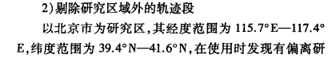

区域调度实验：

1. 通过数据分析得出乘客需求的时空分布，用网格道路模拟车辆和乘客上车点的时空分布，
   1. 通过文献参考，找到工作日的高峰时间和低谷时间，用这两个状态模拟人多车少和车多人少的情况
      1. 统计海淀区的乘客请求和车辆分布
      2. 统计海淀区的分块，统计每个块的路口数目和块内车乘分布
      3. 根据统计进行乘客和车辆的模拟
   2. 通过数据分析，找到特定时间点的车辆乘客区域分布状况，用网格道路模拟出状况
   3. 进行测试实验，设置好要收集的数据

2. 五位区域调度和六位区域调度的结果对比

3. 进行调度实验，分析调度结果和预设最佳匹配结果的符合程度

基于网约车订单数据的居民出行特征研究 ——以北京市为例 崔宇超

经纬度越界数据，位于北 京市坐标范围 115.7°E~117.4°E，39.4°N~41.6°N 之 外的数据；

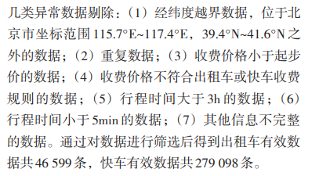

出租车网络订单的行程时间在 10~ 50min内占比约为80%，其中行程时间在20min内的 占22.8%，20~30min的占24.5%，30~40min的占21.2%， 40~50min的占13.5%，平均行程时间为35.5min；快 车网络订单的行程时间大于30min的较少，行程时 间主要集中于10~20min，其中20min内的占66.7%， 20~30min的占17.1%，平均行程时间为21.9min。

图4可以发现，出租车上客点集 中于国贸CBD 区域、望京CBD 区域、西单商业区 附近区域、中关村区域、西二旗区域及首都机场 T3 航站楼；出租车下客点集中于国贸 CBD 区域、 望京 CBD 区域、西单商业区附近区域、中关村区 域、北京西站、北京南站及首都机场T2、T3航站 楼。

【参考文献】：基于网约车数据的居民出行需求特征分析及需求 预测 贾兴无：

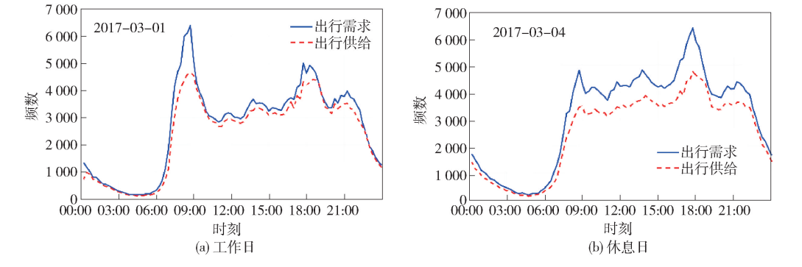

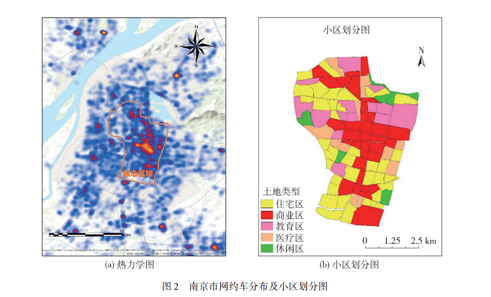

小区范围在1km到2km之间，其覆盖的城区范围大小与**6位长度**GeoHash（452m*1216m）瓦片所覆盖的范围相近，面积约为其两倍

文章提出用WAVE-SVM模型来预测不同小区内的出行需求，对不同区域工作日和休息日的出行需求时间序列进行预测，

预测结果为各小区在全天各个时刻的需求频数

我的工作要做不同车乘分布下的车乘匹配工作，需要对比出行高峰和平峰时的匹配表现，**以工作日为参考**

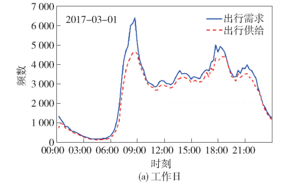

**高峰期定义：**出行需求超过出行供给，即乘客需求数目超过空车数目。由图分析，高峰期的区域内空车数目为出行需求频数的**三分之二**

**平峰期定义：**出行供给满足出行需求，即乘客需求数目少于空车数目。小区内空车数量完全可以**满足**区域内的需求数量

由图可得9：00为典型的出行高峰期，14：00为典型平峰期

工作日各小区9：00时刻的平均出行频数为15-90人次，设置各区域乘客需求为90，车辆60

工作日各小区14：00时刻的平均出行频数为60人次，设置各区域乘客需求为60，车辆60

### 环境设置：

**空车分布：**

高峰期空车数量为出行请求的三分之二，平峰期空车数量等于或大于区域内的乘车请求。所有空车按照随机均匀分布的方式在各区域内初始化位置。

**出行请求（上车点）分布：**

1. 80%的出行需求集中在6位GeoHash区域的中心区域内，其余20%需求在6位GeoHash的边缘区域随机均匀分布，用来模拟**高峰时刻**高校、工作机构坐落在GeoHash区域**中心**时的乘车环境

2. 80%的出行需求随机平均分布在6位GeoHash区域的边缘区域，其余20%需求集中在6位GeoHash的中心区域，用来模拟**高峰时刻**高校、工作机构坐落在GeoHash区域**边缘**时的乘车环境

3. 出行需求在6位GeoHash区域内**平均**分布，用来模拟**平峰时刻**的乘车请求分布

**收集数据：**

	1. 车辆和乘客的匹配结果id、各自位置、两者之间的距离
	1. 乘客发出请求到匹配到车辆的响应时间
	1. 调度算法消耗的gas

auto.js生成账户时不能一次生成太多，超过20个之后会把区块链控制台杀死

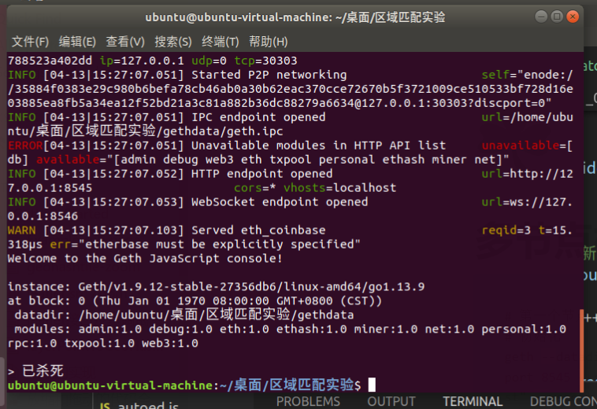

但是直接在控制台粘贴30个personal.newAccount却是可以慢慢创建30个账户的，或许是脚本请求太密集的原因？

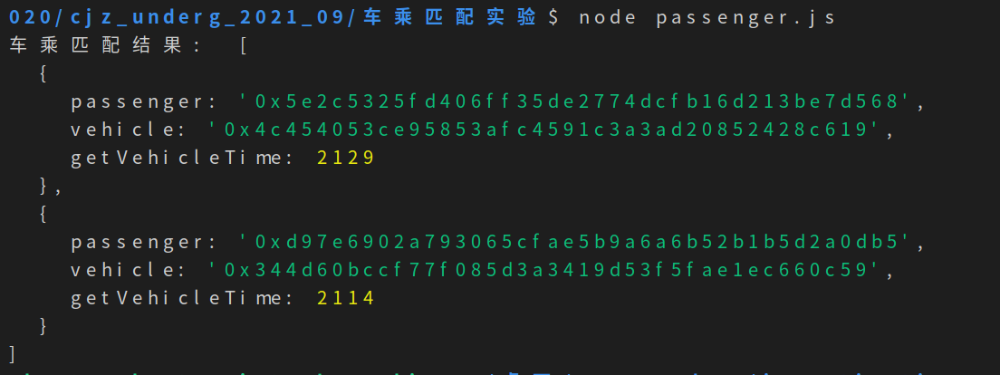

进行两车两乘客的匹配实验，实验成功

进行**10辆车和10个乘客**平均分布的实验，匹配为全局查找，可以得到结果

进行**20辆车和20个乘客**的匹配实验：可以得到结果

进行**50辆车和50个乘客**的实验：可以得到结果

**100车辆100乘客**：可以得到结果

打车起止点是由集中到分散，或由分散到集中（考虑五位GeoHash范围内乘客上车点集中或者分散的问题，集中集中在区域中心，分散则在区域内均匀分布）

传统区块链全局调度

 	1. 平峰均匀1
 	2. 高峰均匀4
 	3. 高峰集中7
 	4. 高峰边缘10

地理位置区块链6位GeoHash大范围调度

 	1. 平峰均匀2
 	2. 高峰均匀5
 	3. 高峰集中8
 	4. 高峰边缘11

地理位置区块链7位GeoHash邻居区域调度

 	1. 平峰均匀3
 	2. 高峰均匀6
 	3. 高峰集中9
 	4. 高峰边缘12

**先写脚本**

总体思路：

地理位置区块链，6位GeoHash调度，其响应速度大于全局调度

地理位置区块链，7位GeoHash调度，其匹配结果的距离小于6位GeoHash调度

智能合约数组存储60 * 9 = 540辆车辆ID时，合约遍历数组会超时：

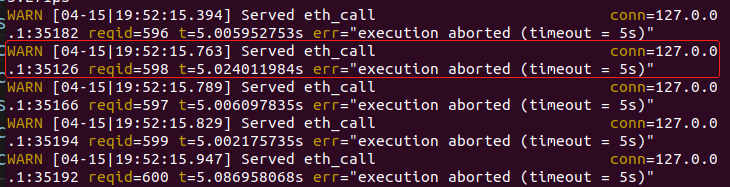

原因：智能合约中遍历的数组长度不能过长，过长会超时

[go ethereum - Contract Call has been reverted by the EVM with the reason: 'execution aborted (timeout = 5s)' - Ethereum Stack Exchange](https://ethereum.stackexchange.com/questions/91908/contract-call-has-been-reverted-by-the-evm-with-the-reason-execution-aborted)

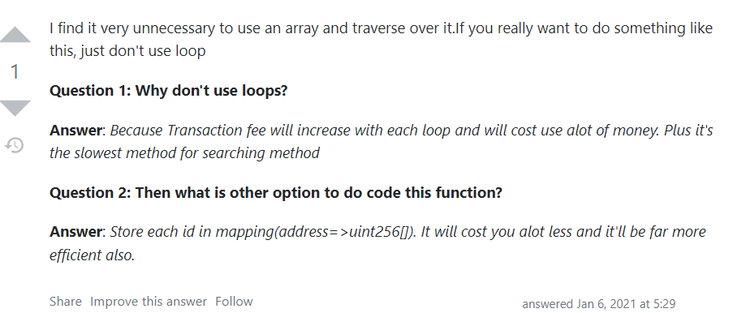

全局查找能支持的每个6位GeoHash区域的车辆数60->30(所有乘客超时)->20(所有乘客超时)->19（只有4个乘客未超时）->18(有4个乘客超时)->17(有7个乘客超时)->16(均未超时)->15(均未超时)

现象：在60个乘客同时发起打车请求后，全局查询算法最多能维护16 * 9 = 144辆车的遍历查询，超过144辆则会返回结果超时，这在一方面说明了在区块链系统中加入地理信息的优势。

继续实验：

设计3 * 3 的9个6位GeoHash区域，模拟平峰期的乘客需求，135个乘客、135辆车，对比全局调度和6位GeoHash区域调度的结果

（结果只有9个请求没有超时）

设计3 * 3 的9个6位GeoHash区域，模拟平峰期的乘客需求，126个乘客、126辆车，对比全局调度和6位GeoHash区域调度的结果

（结果只有15个请求没有超时）

设计3 * 3 的9个6位GeoHash区域，模拟平峰期的乘客需求，117个乘客、117辆车，对比全局调度和6位GeoHash区域调度的结果

（结果只有9个请求没有超时）

设计3 * 3 的9个6位GeoHash区域，模拟平峰期的乘客需求，108个乘客、108辆车，对比全局调度和6位GeoHash区域调度的结果

（结果有75个请求没有超时）

设计3 * 3 的9个6位GeoHash区域，模拟平峰期的乘客需求，99个乘客、99辆车，对比全局调度和6位GeoHash区域调度的结果

（全部匹配成功）

全局调度结果：

6位GeoHash区域调度结果：

99*99实验中有41个乘客未匹配到车辆，原因：匹配到的车辆冲突时，乘客端未进行重新匹配，改后即可。

每个乘客在两种调度方式下获得调度车辆的响应时间，横轴为第n位乘客，纵轴单位为毫秒：

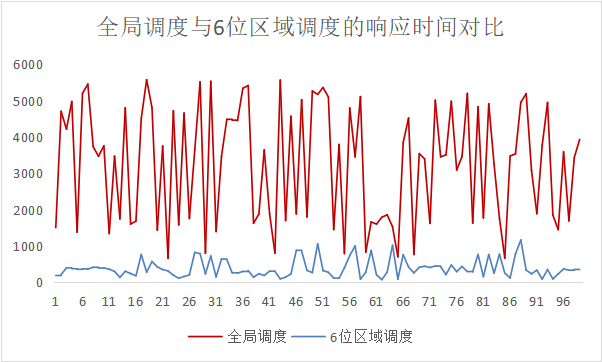

可以观察到，所有乘客进行6位区域调度的响应时间均明显低于全局调度的响应时间；

不同位置乘客，其进行全局调度请求的响应时间区别较大。这是因为，查找距离乘客最近的空时，全局调度需要遍历的车辆较多，若后台未能先找到距离乘客较近的车辆，那么后续找到更近距离的空车后，会多次更改智能合约内部的数据状态，导致响应时间延长。故不同位置的乘客进行全局调度请求时，系统的响应时间区别较大。

相比全局调度，相同乘客进行6位区域调度的响应时间低于全局调度的比例为100%，这说明了在出租车调度系统中应用地理位置区块链的正确性和有效性。

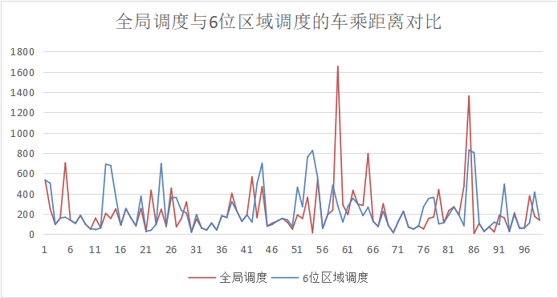

上图，横轴为乘客的代号，纵轴单位：米

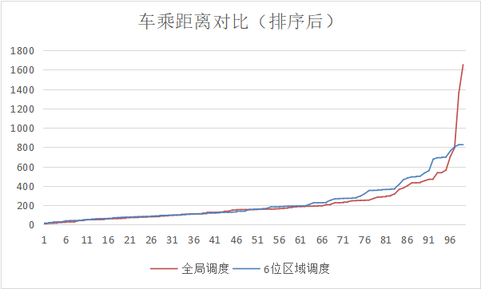

可以观察到，每个乘客在两种环境下的调度请求结果，有时是全局调度的车辆更远，有时是区域调度的车辆更远，但二者绝大部分的距离结果相差并不大（平均起来，每位乘客与其匹配到的车辆的距离，在**6位GeoHash的区域调度**时，只比**全局调度**远**12.240m**）。

但值得注意的是，全局调度中会有乘客匹配到明显较远的车辆，其距离是乘客平均等车距离的7.63倍、6.23倍，让少数乘客付出了更多的等待时间。这说明，相比全局调度而言，区域调度能保证匹配到的出租车不会距离乘客太远，从而提高了所有乘客的打车体验，同时还能保持平均调度距离不明显增加。

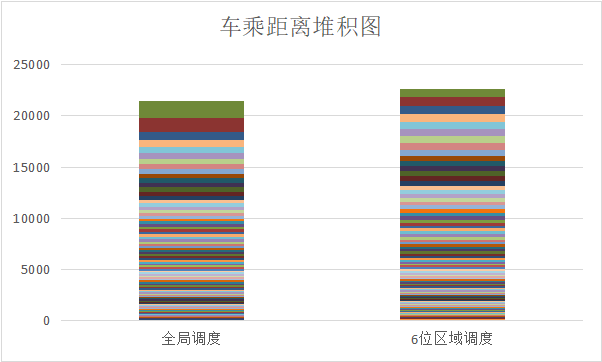

从堆积图中我们也可以看到，本次实验中，从两种调度方法下所有车辆和乘客的匹配结果来看，区域调度的总距离只比全局调度高5.65%。

但区域调度显著降低了系统的响应时间，同时保证了所有乘客的打车体验，证明了地理位置区块链的应用相比传统区块链具有明显优势。

6位区域调度的缺点：

将可选车辆的范围限制在了6位GeoHash区域的范围内，如果乘客的位置在6位GeoHash区域的边缘，则在该6位区域外的相邻区域可能有比原区域内距离乘客更近的空车。

七位GeoHash邻居区域调度：

以乘客位置所在的7位GeoHash区域为中心，根据算法获得其周围的8个邻居区域，地理位置区块链根据这九个区域查询到区域内对应的车辆账户，然后从这些车辆中筛选出距离乘客最近的空车。此调度方法克服6位GeoHash区域调度的边界现象，让车乘匹配的结果更合理。

实验验证：

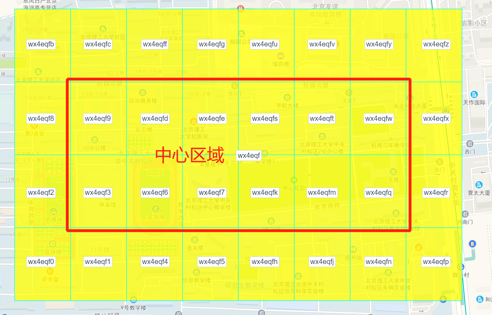

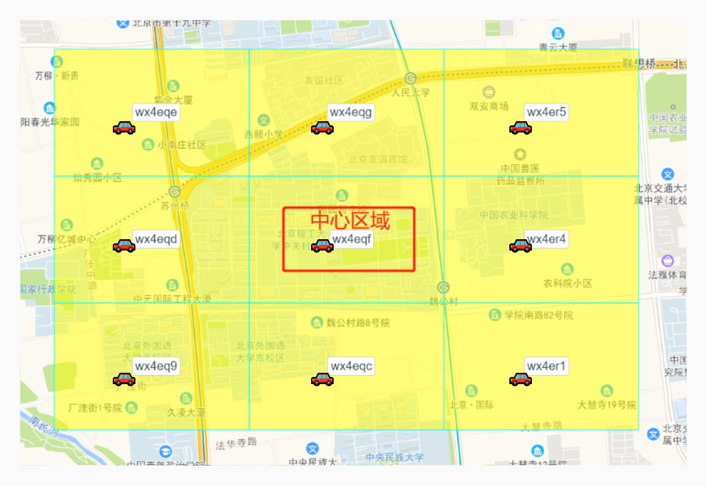

**出行请求（上车点）分布：**

1. 80%的出行需求集中在6位GeoHash区域的中心区域内，其余20%需求在6位GeoHash的边缘区域随机均匀分布，用来模拟**高峰时刻**高校、工作机构坐落在GeoHash区域**中心**时的乘车环境

2. 80%的出行需求随机平均分布在6位GeoHash区域的边缘区域，其余20%需求集中在6位GeoHash的中心区域，用来模拟**高峰时刻**高校、工作机构坐落在GeoHash区域**边缘**时的乘车环境

3. 出行需求在6位GeoHash区域内**平均**分布，用来模拟**平峰时刻**的乘车请求分布

1. 6位区域调度只能调度到自己所属地理区域内的车辆，当自己所处的6位GeoHash地理区域位于边缘高峰期时，车辆的数目不够，有部分乘客的打车请求不会被满足；7位邻居调度可以根据乘客的位置调度到周围邻居区域最近的空车，不受GeoHash地理区域的限制，能够满足更多乘客的打车需求。

   

2. 在各个时期（中心高峰、边缘高峰、平峰），7位邻居调度调度结果的车乘平均距离，比6位GeoHash区域调度结果的车乘平均距离更近，这是因为7位邻居调度优化了6位调度的边界限制，在6位GeoHash地理区域边缘的乘客可以匹配到邻居区域内更近的车辆，而不是匹配到本区域内更远的车辆。

   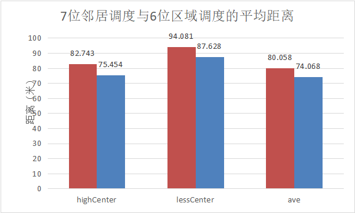

   

3. 调度请求的平均响应时间：7位邻居调度的响应时间更快，原因是相比6位GeoHash的区域，7位的邻居区域所覆盖的范围更合理，范围内的车辆账户数目少而精，后台减少了无效的车辆查找次数，查找最近空车的效率更高。

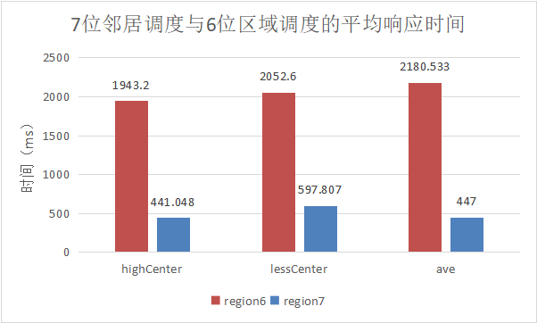

如有可能，筛选一下北京市的道路数据看看有多少条

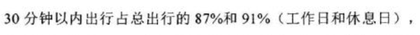